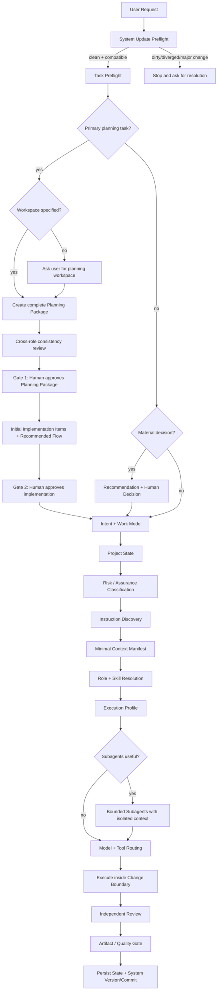
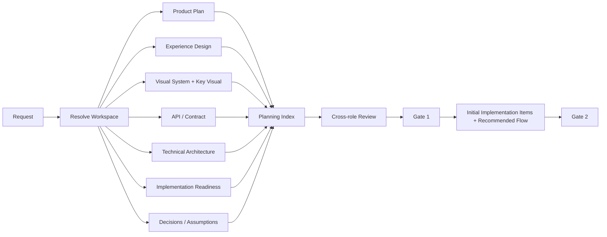
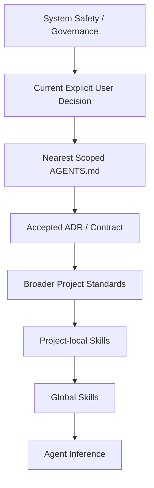
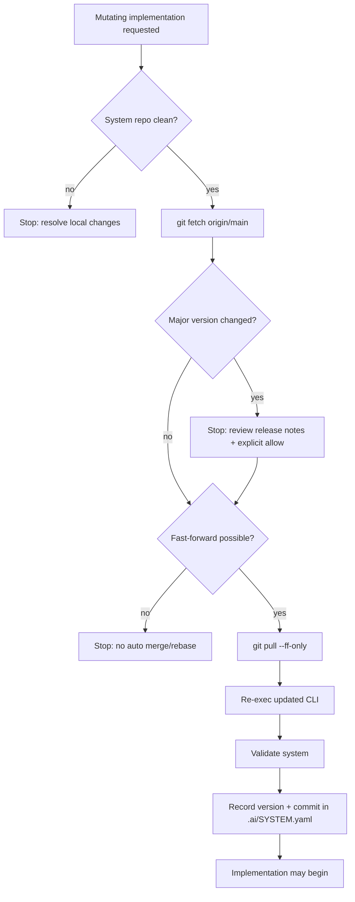

# Architecture

These diagrams are source-controlled architecture artifacts. Update them when the corresponding flow changes.

## Runtime flow

## Primary planning package

## Risk-proportional security assurance

~~~mermaid
flowchart TD
    R[Product / Change] --> RP[Risk Profile]
    RP --> PB[Product Baseline SAL]
    RP --> CI[Change Security Impact]
    PB --> B{Protected boundary touched?}
    CI --> B
    B -->|no| L[Lightweight effective review]
    B -->|yes| F[Apply critical risk floors]
    F --> SAL[Effective SAL 0-4]
    SAL -->|0-1| BASE[Secure defaults / basic hygiene]
    SAL -->|2| STD[Conditional security review]
    SAL -->|3| SR[Independent Security Engineer + evidence]
    SAL -->|4| CR[Critical Security Review]
    CR --> FI[Financial / Business Integrity checks]
    FI --> G{High/Critical unresolved?}
    G -->|yes| BLOCK[BLOCK Release]
    G -->|no| PASS[Security Gate Pass]
~~~

Security Assurance Level is distinct from Reliability Impact and Model Tier. A critical product may still have a low Effective SAL for a cosmetic change that touches no protected boundary.

## Existing-project instruction resolution

## Update preflight

Any change to runtime flow, planning gates, precedence, model routing, workspace contract, CLI lifecycle or release behavior must pass the Documentation Impact Gate in `docs/MAINTENANCE.md`.

## System self-improvement and constitutional governance

~~~mermaid
flowchart TD
    U[User System Suggestion] --> R[System Improvement Review]
    R --> F[Fit / overlap / simplification / extra optimization / compatibility]
    F --> C{Constitution impact?}
    C -->|no| D[Recommended Direction]
    D --> UA{User approves direction?}
    UA -->|no| REV[Revise / stop]
    UA -->|yes| CORE{Large / Core change?}
    C -->|yes| CC[Constitutional Change Proposal]
    CC --> AR[Articles + risks + lower-layer alternative]
    AR --> CA{Explicit Constitutional Approval?}
    CA -->|no| REV
    CA -->|yes| CORE
    CORE -->|yes| CP[Core Change Proposal]
    CP --> CPA{User approves scope?}
    CPA -->|no| REV
    CPA -->|yes| I[Implement]
    CORE -->|no| I
    I --> V[Tests / Review / Documentation Impact]
    V --> GP[Git Publish Proposal]
    GP --> PA{User approves publication?}
    PA -->|no| HOLD[Hold remote publication]
    PA -->|yes| PUSH[Push / PR / Release]
    PUSH --> DRIFT{Material drift?}
    DRIFT -->|yes| GP
    DRIFT -->|no| DONE[Complete]
~~~

The Constitution is the highest internal authority. Prefer lower-layer changes whenever they solve the problem.
