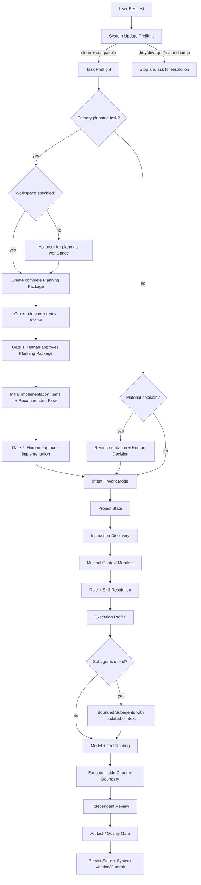
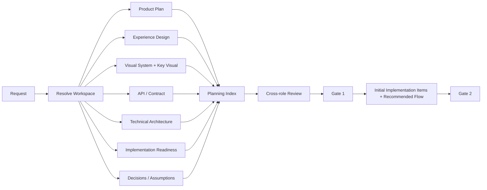
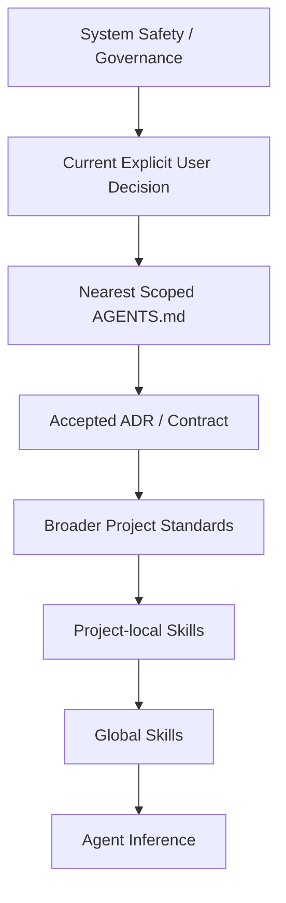
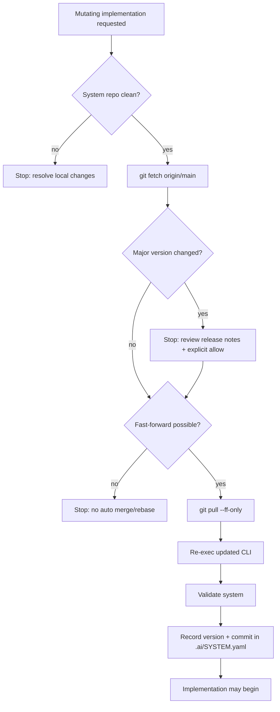

# Architecture

These diagrams are source-controlled architecture artifacts. Update them when the corresponding flow changes.

## Runtime flow

## Primary planning package

## Existing-project instruction resolution

## Update preflight

Any change to runtime flow, planning gates, precedence, model routing, workspace contract, CLI lifecycle or release behavior must pass the Documentation Impact Gate in `docs/MAINTENANCE.md`.
