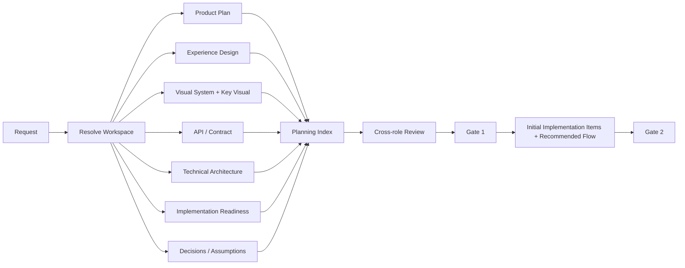

# Architecture

These diagrams are source-controlled architecture artifacts. Update them when the corresponding flow changes.

## Runtime flow

~~~mermaid
flowchart TD
    S[Agent Session / User Request] --> H{Global Harness installed?}
    H -->|yes| HR[Harness Resolve: runtime / project / mode]
    H -->|no| AIPS[AIPS direct entry]
    HR --> AP{AIPS engineering task?}
    AP -->|no| CHAT[Normal Agent Conversation]
    AP -->|yes| UP[System Update Preflight for mutation]
    AIPS --> UP
    UP --> PM{Project mode}
    PM -->|EPHEMERAL| E[No .ai persistence]
    PM -->|ATTACHED| PSTATE[Load .ai state / knowledge]
    E --> INS[Compose runtime-native + project instructions]
    PSTATE --> INS
    INS --> TP[Task Preflight / Requirement Readiness]
    TP --> PLAN{Primary planning task?}
    PLAN -->|yes| PP[Planning Package + Quality Profile]
    PLAN -->|no| WM[Work Mode / Change Boundary]
    PP --> G1[Gate 1 Planning Approval]
    G1 --> G2[Gate 2 Implementation Approval]
    G2 --> WM
    WM --> R[Role / Skill / Model / Tool Routing]
    R --> X[Execute]
    X --> REV[Independent / Multi-Perspective Review]
    REV --> Q[Artifact / Quality / Security Evidence]
    Q --> LC{Complete product?}
    LC -->|no| DONE[Persist only if mode permits]
    LC -->|yes| LOCAL[LOCAL_COMPLETE]
    LOCAL --> PROD{Production requested?}
    PROD -->|no| DONE
    PROD -->|yes| PE[Production Enablement]
    PE --> RR[Release Readiness]
    RR --> PV[PRODUCTION_VERIFIED]
    PV --> DONE
~~~

The Harness is always available after installation, but full AIPS orchestration is only activated for applicable engineering/product work. EPHEMERAL mode never creates persistent project state automatically.

## Primary planning package

## Risk-proportional security assurance

~~~mermaid
flowchart TD
    R[Product / Change] --> RP[Risk Profile]
    RP --> PB[Product Baseline SAL]
    RP --> CI[Change Security Impact]
    PB --> B{Protected boundary touched?}
    CI --> B
    B -->|no| L[Lightweight effective review]
    B -->|yes| F[Apply critical risk floors]
    F --> SAL[Effective SAL 0-4]
    SAL -->|0-1| BASE[Secure defaults / basic hygiene]
    SAL -->|2| STD[Conditional security review]
    SAL -->|3| SR[Independent Security Engineer + evidence]
    SAL -->|4| CR[Critical Security Review]
    CR --> FI[Financial / Business Integrity checks]
    FI --> G{High/Critical unresolved?}
    G -->|yes| BLOCK[BLOCK Release]
    G -->|no| PASS[Security Gate Pass]
~~~

Security Assurance Level is distinct from Reliability Impact and Model Tier. A critical product may still have a low Effective SAL for a cosmetic change that touches no protected boundary.

## Existing-project instruction resolution

~~~mermaid
flowchart TD
    EXT[Platform / Safety Constraints] --> GOV[AIPS Constitution / Governance]
    GOV --> U[Current Explicit User Decision]
    U --> RN[Runtime-native Instructions]
    RN --> N[Nearest Project Instructions / AGENTS]
    N --> ADR[Accepted ADR / Contract]
    ADR --> DOC[Official Project Docs]
    DOC --> PK[Project Knowledge Cache]
    PK --> PS[Project-local Skills]
    PS --> GS[AIPS Skills]
    GS --> INF[Agent Inference]
~~~

Runtime-native mandatory precedence is respected. AIPS composes instructions; it does not overwrite user-owned runtime/project instructions.

## Update preflight

~~~mermaid
flowchart TD
    C[Mutating implementation requested] --> G{System repo clean?}
    G -->|no| STOP[Stop: resolve local changes]
    G -->|yes| F[git fetch origin/main]
    F --> M{Major version changed?}
    M -->|yes| H[Stop: review release notes + explicit allow]
    M -->|no| FF{Fast-forward possible?}
    H --> FF
    FF -->|no| STOP2[Stop: no auto merge/rebase]
    FF -->|yes| P[git pull --ff-only]
    P --> RE[Re-exec updated CLI]
    RE --> VAL[Validate system]
    VAL --> MODE{Project attached?}
    MODE -->|yes| REC[Update .ai/SYSTEM.yaml provenance]
    MODE -->|no| E[Remain EPHEMERAL; create no .ai]
    REC --> OK[Implementation may begin]
    E --> OK
~~~

Preflight updates AIPS, not the target project's Git repository, and no longer performs implicit Attach.

## System self-improvement and constitutional governance

~~~mermaid
flowchart TD
    U[User System Suggestion] --> R[System Improvement Review]
    R --> F[Fit / overlap / simplification / extra optimization / compatibility]
    F --> C{Constitution impact?}
    C -->|no| D[Recommended Direction]
    D --> UA{User approves direction?}
    UA -->|no| REV[Revise / stop]
    UA -->|yes| CORE{Large / Core change?}
    C -->|yes| CC[Constitutional Change Proposal]
    CC --> AR[Articles + risks + lower-layer alternative]
    AR --> CA{Explicit Constitutional Approval?}
    CA -->|no| REV
    CA -->|yes| CORE
    CORE -->|yes| CP[Core Change Proposal]
    CP --> CPA{User approves scope?}
    CPA -->|no| REV
    CPA -->|yes| I[Implement]
    CORE -->|no| I
    I --> V[Tests / Review / Documentation Impact]
    V --> GP[Git Publish Proposal]
    GP --> PA{User approves publication?}
    PA -->|no| HOLD[Hold remote publication]
    PA -->|yes| PUSH[Push / PR / Release]
    PUSH --> DRIFT{Material drift?}
    DRIFT -->|yes| GP
    DRIFT -->|no| DONE[Complete]
~~~

The Constitution is the highest internal authority. Prefer lower-layer changes whenever they solve the problem.

## Creative direction and brand reuse

~~~mermaid
flowchart TD
    U[User Creative Request] --> B{Approved Brand System?}
    B -->|yes| BP[Load BRAND_PROFILE first]
    B -->|no| A[Use user assets / references]
    BP --> A
    A --> R{Direction already clear?}
    R -->|no| RR[Runtime Reference Research]
    RR --> D[2-3 Differentiated Directions]
    D --> C[Progressive Calibration]
    C --> L[Creative Direction Lock]
    R -->|yes| L
    L --> G[Design / Generate]
    G --> V[Visual Quality Review]
    V --> O[Persist artifact + direction/evidence]
~~~

Styles are reference data, not skills. Brand knowledge is project knowledge, not a global skill.

## Capability incubation

~~~mermaid
flowchart LR
    N[New capability request] --> S[Search Role/Capability/Skill indexes]
    S --> O{Overlap?}
    O -->|high| R[Reuse]
    O -->|partial| E[Extend existing]
    O -->|low| K[Create minimal Skill]
    K --> T[Scenario + Trial]
    T --> P{Distinct responsibility + authority + review?}
    P -->|no| K2[Keep as Skill/Capability]
    P -->|yes| ROLE[Promote Role]
~~~

The system prefers reuse and extension over duplicate knowledge.

## Deterministic automation

~~~mermaid
flowchart TD
    X[Task step] --> D{Rule-based and verifiable?}
    D -->|no| AI[AI reasoning]
    D -->|yes| ET{Existing tool?}
    ET -->|yes| RUN[Run tool]
    ET -->|no| H[Create small Shell/Python helper]
    H --> RUN
    RUN --> S[Structured JSON/YAML summary]
    S --> AI2[AI reads summary]
    AI2 --> RAW{Need raw evidence?}
    RAW -->|yes| E[Open targeted evidence]
    RAW -->|no| DONE[Continue]
~~~

Helper lifetime is run-local → project reusable → system reusable only after demonstrated reuse.

## Documentation audiences

~~~mermaid
flowchart TD
    CHANGE[System Behavior Change] --> CORE{Large / Core?}
    CHANGE --> H{Human usage affected?}
    CHANGE --> A{Agent behavior affected?}
    CORE -->|yes| DIA[Architecture Diagram Impact Check]
    H -->|yes| HD[Update Traditional Chinese Human Docs]
    A -->|yes| AD[Update concise Agent Docs]
    DIA --> M1[Mermaid / Human SVG / Overview]
    HD --> G[Documentation Impact Gate]
    AD --> G
    M1 --> G
    CORE -->|no| G
~~~

For Large/Core changes, architecture-diagram impact is mandatory. Update each affected diagram or record N/A with a concrete reason. Human and Agent docs remain separate entry surfaces but share one behavior source.

## End-to-end product delivery

~~~mermaid
flowchart TD
    U[User Request / Assets] --> Q[Q1/Q2/Q3 Quality Planning]
    Q --> PP[Planning Package]
    PP --> G1[Gate 1 Planning Approval]
    G1 --> G2[Gate 2 Implementation Approval]
    G2 --> I[Implementation + Observability Instrumentation]
    I --> V[Local Tests / Security / Quality Evidence]
    V --> LC[LOCAL_COMPLETE]
    LC --> R{Production requested already?}
    R -->|no| ASK{Continue to Production?}
    ASK -->|no| HOLD[Persist Local Product]
    ASK -->|yes| PE[Production Enablement]
    R -->|yes| PE
    PE --> INF[Infra / CI-CD / Secrets / Data / Recovery]
    INF --> OBS[Observability Stack]
    OBS --> ST{Staging applicable?}
    ST -->|yes| SV[Deploy + Smoke / E2E / Security / Migration]
    ST -->|no with reason| RR[Release Readiness]
    SV --> RR
    RR --> READY{READY?}
    READY -->|no| FIX[Fix / re-verify]
    FIX --> RR
    READY -->|yes| PROD[Production Promotion]
    PROD --> PV[Health / Smoke / Logs / Metrics / Alerts]
    PV --> OK{Healthy?}
    OK -->|no| REC[Rollback / Roll-forward]
    REC --> PV
    OK -->|yes| DONE[PRODUCTION_VERIFIED]
~~~

LOCAL_COMPLETE is a valid complete delivery state when Production is not requested. Production completion requires applicable post-deploy verification and recovery evidence.

## Product workspace and deployment units

~~~mermaid
flowchart LR
    P[Product Workspace] --> M[PRODUCT.yaml]
    P --> DOC[Docs / Brand / Decisions]
    P --> F[Frontend Deployment Unit]
    P --> B[Backend Deployment Unit]
    P --> W[Worker / Job Deployment Unit]
    P --> DB[Database / Migrations]
    P --> I[Infra / Deployment]
    F --> R{Repository strategy}
    B --> R
    W --> R
    R -->|default| MONO[Monorepo]
    R -->|evidence-driven| MULTI[Multi-Repo]
~~~

Independent deployability does not imply independent repositories.

## Release readiness

Release Readiness consolidates evidence for one exact candidate:

~~~text
Build
+ Static / Unit / Integration / Contract / E2E / Smoke
+ Security Assurance
+ Migration / Recovery
+ Infrastructure
+ Staging
+ Observability
+ Deployment / Runbook / Rollback
= READY / NOT_READY / BLOCKED
~~~

READY is technical readiness. It never bypasses required human/security approval.

## Progressive requirement clarification

~~~mermaid
flowchart TD
    U[User Request] --> R{Implementation-ready?}
    R -->|yes| READY[READY]
    R -->|no| D{Safe professional default?}
    D -->|yes| DEF[Apply / record default]
    DEF --> READY
    D -->|no| C[NEEDS_CLARIFICATION]
    C --> Q[Ask smallest material question + options]
    Q --> R
    C --> B{Required dependency unavailable?}
    B -->|yes| BLOCK[BLOCKED]
~~~

Ambiguity alone does not justify interrupting the user. Ask only when a material decision cannot be safely derived.

## External context resolution

~~~mermaid
flowchart TD
    S[User-provided source] --> P[Identify Provider]
    P --> C{Connector / MCP available?}
    C -->|yes| A{Authorized?}
    A -->|yes| R[Retrieve exact source]
    A -->|no| AUTH[Guide authorization + preserve task]
    AUTH --> R
    C -->|no| W{Public URL accessible?}
    W -->|yes| R
    W -->|no| O{Other supported provider/API?}
    O -->|yes| R
    O -->|no| U[Request minimal user-provided export/text/screenshot]
    R --> RESUME[Resume original task]
~~~

Exact user-provided source evidence has priority over generic search/inference.

## Visual implementation polish

~~~mermaid
flowchart TD
    U[Existing UI request] --> MODE{Scope}
    MODE -->|Focused| V1[V1 Focused Repair]
    MODE -->|Whole project vague cleanup| V2[V2 Product Consistency Sweep]
    V2 --> VP{Current Visual Profile?}
    VP -->|yes/current| BASE[Load baseline / golden components]
    VP -->|missing/stale| DISC[Representative routes + component inventory]
    DISC --> BASE
    V1 --> RUN[Run / Render target]
    BASE --> RUN
    RUN --> OUT[Detect material visual outliers]
    OUT --> VAR{Valid variant / exception?}
    VAR -->|yes| KEEP[Keep]
    VAR -->|no| ROOT[Map DOM / Component / Computed Style / Token]
    ROOT --> FIX[Shared token/component fix first]
    FIX --> VERIFY[Before/After + Responsive + State Geometry]
    VERIFY --> FIND{Material finding remains?}
    FIND -->|yes| OUT
    FIND -->|no| PROFILE[Refresh Project Visual Profile if reusable]
~~~

Source-only review cannot PASS when the UI can be rendered.

## Multi-perspective review and learning

~~~mermaid
flowchart TD
    C[Large / Core / High-risk Change] --> RP[Resolve smallest Review Panel]
    RP --> PAR[Parallel bounded read-only reviews]
    PAR --> FIND[Normalize + Deduplicate Findings]
    FIND --> CONFLICT{Reviewer conflict?}
    CONFLICT -->|yes| DEC[Architect / Security governance / Human decision]
    CONFLICT -->|no| AUTHOR[Original Author Fix]
    DEC --> AUTHOR
    AUTHOR --> TEST[Tests / Evidence]
    TEST --> RE[Targeted Re-review]
    RE --> PASS{Material findings resolved?}
    PASS -->|no| AUTHOR
    PASS -->|yes| LESSON[Extract Run / Project / System Capability Lessons]
    LESSON --> USER{Generalizable system improvement?}
    USER -->|yes| SIR[Recommend System Improvement to user]
    USER -->|no| DONE[Done]
~~~

Multi-review is selected by semantic impact/risk, not LOC alone. Reviewers do not silently expand scope or modify permanent Agent capability.

## Installation and project lifecycle

~~~mermaid
flowchart TD
    CLONE[Clone AIPS] --> INSTALL[aips install]
    INSTALL --> CORE[CLI / venv / config]
    INSTALL --> HAR[Global Harness Ownership]
    HAR --> DET[Detect Agent Runtimes]
    DET --> AD{Safe automatic Adapter?}
    AD -->|yes| AUTO[AIPS-owned AUTOMATIC Adapter]
    AD -->|no| MAN[MANUAL / preserve user config]
    AUTO --> USE[Normal Agent Session]
    MAN --> USE
    USE --> PM{Project .ai exists?}
    PM -->|no| E[EPHEMERAL]
    PM -->|yes| A[ATTACHED]
    E --> AT[aips attach only when persistence desired]
    AT --> A
    A --> DT[aips detach preserves .ai archive]
    DT --> E
    USE --> UN[aips uninstall]
    UN --> OWN[Remove only AIPS-owned integrations]
    OWN --> KEEP[Preserve user/project instructions, Skills, source, .ai]
    KEEP --> RM[Optional explicit repo removal by user]
~~~

Install/Uninstall lifecycle is non-invasive: existing user Agent files and Skills are never overwritten for automatic coverage.

## Quality-aware product delivery

~~~mermaid
flowchart TD
    U[Product Request] --> Q[Q1/Q2/Q3 Quality Planning]
    Q --> P[Planning + Architecture]
    P --> I[Implementation + Observability Instrumentation]
    I --> V[Local Tests / Security / Quality Evidence]
    V --> LC[LOCAL_COMPLETE]
    LC --> R{Production already requested?}
    R -->|no| ASK{User wants Production?}
    ASK -->|no| DONE[Persist Local Product]
    ASK -->|yes| PE[Production Enablement]
    R -->|yes| PE
    PE --> O[Infra / CI-CD / Data / Observability]
    O --> ST[Staging when applicable]
    ST --> RR[Release Readiness]
    RR --> PROD[Production]
    PROD --> PV[Health / Smoke / Logs / Metrics / Alerts]
    PV --> DONE2[PRODUCTION_VERIFIED]
~~~

Quality classes are adjustable baselines. Quality targets feed architecture, implementation and verification.

## Project Knowledge

~~~mermaid
flowchart TD
    T[Existing Project Task] --> A[Scoped AGENTS / ADR / Contract / Official Docs]
    A --> K{Knowledge Index exists?}
    K -->|yes| L[Load only relevant topics]
    K -->|no| G[Identify reusable knowledge gaps]
    L --> S{Knowledge sufficient/current?}
    S -->|yes| E[Execute task]
    S -->|no| G
    G --> D[Targeted Project Knowledge Discovery]
    D --> X{Authoritative source already exists?}
    X -->|yes| PTR[Store pointer only]
    X -->|no| PERSIST[Persist concise stable derived knowledge]
    PTR --> E
    PERSIST --> E
    E --> C{Watched paths/signals changed?}
    C -->|yes| REFRESH[Targeted topic refresh]
    C -->|no| END[Keep knowledge current]
~~~

Project Knowledge is a discovery cache, not governance authority.

## Visual consistency repair

~~~mermaid
flowchart TD
    U[Whole-project weird/inconsistent UI] --> VP{Current Visual Profile?}
    VP -->|yes| STALE{Stale?}
    VP -->|no| DISC[Discover routes/components]
    STALE -->|no| BASE[Load baseline]
    STALE -->|yes| DISC
    DISC --> R[Render representative routes]
    R --> INV[Component Inventory]
    INV --> BASE2[Infer UI Consistency Baseline]
    BASE --> OUT[Detect Outliers]
    BASE2 --> OUT
    OUT --> VAR{Valid variant / exception?}
    VAR -->|yes| KEEP[Keep]
    VAR -->|no| ROOT[Map DOM / Component / Style / Token Root Cause]
    ROOT --> FIX[Shared Fix First]
    FIX --> VERIFY[Before/After + Responsive + State Geometry]
    VERIFY --> FIND{Material findings remain?}
    FIND -->|yes| OUT
    FIND -->|no| PROFILE[Update Project Visual Profile]
~~~
