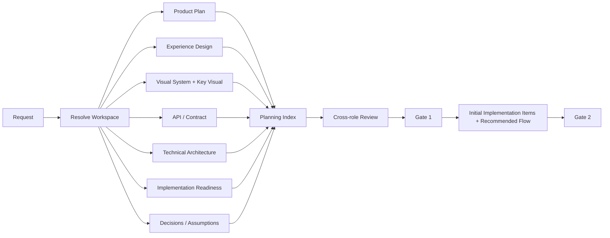

# Architecture

These diagrams are source-controlled architecture artifacts. Update them when the corresponding flow changes.

## Runtime flow

~~~mermaid
flowchart TD
    S[User Prompt] --> RA[Runtime Adapter]
    RA --> TC[Compact Turn Context]
    TC --> ENG{Engineering / Project task?}
    ENG -->|no| CHAT[Normal conversation]
    ENG -->|yes| ID[Resolve repository_id + workspace_id]\n    ID --> P[Resolve Project Mode + Intelligence Store]
    P --> I{Intelligence state}
    I -->|MISSING| B[Read-only Bootstrap]
    I -->|STALE| R[Targeted Refresh]
    I -->|CURRENT| L[Load relevant stable Intelligence]
    B --> E[Semantic Enrichment]
    E --> F[Finalize READY]
    F --> IDX[Ensure rebuildable Retrieval Index]
    R --> L
    L --> Q{Retrieval index available?}
    Q -->|yes| RET[Hybrid JIT Retrieval: lexical + symbols + structural + tests + graph + Git history]
    Q -->|no| DEG[Truthful fallback to stable Intelligence]
    IDX --> RET
    RET --> BUD[Rank + token budget + provenance]
    DEG --> M{Existing-project mutation?}
    BUD --> M
    M -->|yes| CI[Change Impact Guard]
    M -->|no| ROUTE[AIPS Routing]
    CI --> ROUTE
    ROUTE --> ISO{Execution isolation}
    ISO -->|shared| X[Plan / Execute in current workspace]
    ISO -->|worktree| WT[Real AIPS-owned Git worktree]
    ISO -->|verified sandbox| SB[External sandbox provider]
    ISO -->|sandbox unavailable| BLOCK[UNSUPPORTED / BLOCKED]
    WT --> X
    SB --> X
    X --> V[Test / Review / Actual Impact Reconciliation]
    V --> IR[Targeted Intelligence Refresh]
    IR --> DONE[Persist / Complete]
~~~

The synchronous Turn Hook resolves identity/freshness plus bounded evidence from an already available Retrieval Index. Whole-project bootstrap, initial index construction, semantic enrichment, impact-graph rebuilding and HTML generation stay outside the hook latency path. Retrieval cache state is non-canonical and degrades truthfully to stable Project Intelligence when unavailable.

## Retrieval quality evaluation

~~~mermaid
flowchart LR
    CASE[Repository-specific evaluation cases] --> BASE[Static topic-context baseline]
    CASE --> RET[Current local hybrid retrieval]
    BASE --> MET[Deterministic retrieval metrics]
    RET --> MET
    MET --> REP[Evidence-only report + fingerprints]
    REP --> H{Human review}
    H -->|measured gap justifies it| OPT[Normal System Improvement path]
    H -->|insufficient evidence| KEEP[Keep current retrieval architecture]
~~~

The evaluator measures task-specific evidence retrieval only. It records deterministic quality/token metrics plus informational observed latency, and has no authority to enable semantic providers, change rank weights or select a new retrieval technology.

### Adopted structural retrieval + retained trial replay

~~~mermaid
flowchart LR
    Q[Task query with exact symbol seed] --> L[Lexical-index bridge discovery]
    L --> BR[Bridge chunks]
    BR --> ID[Bounded exact identifiers]
    ID --> DEF[Indexed target definitions]
    DEF --> TEST[Companion test boost]
    TEST --> RANK[Hybrid ranking + token budget]
    RANK --> CTX[Turn Context]

    TRIAL[Scenario 130 replay] --> OFF[Explicit structural OFF baseline]
    TRIAL --> ON[Explicit structural ON candidate]
    OFF --> CMP[Same corpus metrics]
    ON --> CMP
~~~

Structural Retrieval is part of normal Turn Context after Human Adoption Decision. The implementation remains bounded and dependency-free; `--no-structural` exists for diagnostic comparison, while the retained Trial harness can still replay OFF/ON behavior.

### Semantic alias candidate trial

~~~mermaid
flowchart LR
    Q[Low lexical overlap / synonymy query] --> BASE[Current default retrieval]
    Q --> ALIAS[Version-controlled alias groups]
    ALIAS --> EXP[Low-weight expanded terms]
    EXP --> CAND[Current retrieval + alias lane]
    BASE --> CMP[Same corpus metrics]
    CAND --> CMP
    CMP --> G{Required regression? / Synonym recall improved?}
    G -->|FAIL| KEEP[Keep alias lane disabled]
    G -->|PASS| EVID[Trial evidence only]
    EVID --> H[Separate Human Adoption Decision]
~~~

The alias candidate is deterministic and transparent. It is not an embedding provider and does not change `semantic.status=NOT_CONFIGURED`. The committed Trial follows the FAIL → KEEP branch: required regressions and no synonym-recall improvement produce recommendation `HOLD`. Normal Turn Context retrieval therefore does not enable the alias lane.

### Remote embedding Trial readiness

~~~mermaid
flowchart LR
    FIX[9-case synthetic fixture] --> BASE[Current default retrieval]
    FIX --> EMB[Remote embedding candidate]
    EMB --> MEM[Ephemeral in-memory cosine ranking]
    BASE --> MET[Same retrieval metrics]
    MEM --> MET
    MET --> OUT{Trial result}
    OUT -->|credential missing| PEND[TRIAL_PENDING]
    OUT -->|provider failure| BLOCK[TRIAL_BLOCKED]
    OUT -->|quality fail| HOLD[FAIL / HOLD]
    OUT -->|quality pass| REVIEW[PASS / Human review]
    REVIEW --> HAD[Separate Human Adoption Decision]
~~~

The remote candidate is explicitly synthetic-only. Normal PR/main validation never sends repository source to an embedding provider. The dedicated Trial workflow uses bounded request/chunk/input limits, protected secret injection and no Vector DB; production source transfer and default embedding enablement remain false.

### Provider-neutral local-first embedding Trial

~~~mermaid
flowchart LR
    FIX[9-case synthetic fixture] --> BASE[Current default retrieval]
    FIX --> SEL{Embedding provider}
    SEL -->|default| LOCAL[Pinned local BGE model]
    LOCAL --> LINFER[Runner-local inference]
    SEL -->|explicit optional| REMOTE[OpenAI-compatible remote adapter]
    REMOTE --> RSTATE{Credential available?}
    RSTATE -->|no| PEND[TRIAL_PENDING]
    RSTATE -->|yes| RINFER[Remote synthetic-only inference]
    LINFER --> MEM[Ephemeral in-memory cosine ranking]
    RINFER --> MEM
    BASE --> MET[Same retrieval metrics]
    MEM --> MET
    MET --> OUT{Quality result}
    OUT -->|runtime/provider failure| BLOCK[TRIAL_BLOCKED / HOLD]
    OUT -->|quality fail| HOLD[FAIL / HOLD]
    OUT -->|quality pass| REVIEW[PASS / Human review]
    REVIEW --> HAD[Separate Human Adoption Decision]
~~~

Scenario 134 makes local inference the default Trial path, so `OPENAI_API_KEY` is no longer a prerequisite for real embedding quality evidence. The local model/runtime and exact model revision are pinned; model artifact download is allowed only as Trial infrastructure and does not transmit query/source content. The existing remote adapter remains an explicit optional comparison path. Normal PR/main validation and normal Turn Context still do not execute embedding inference.

## Primary planning package

## Risk-proportional security assurance

~~~mermaid
flowchart TD
    R[Product / Change] --> RP[Risk Profile]
    RP --> PB[Product Baseline SAL]
    RP --> CI[Change Security Impact]
    PB --> B{Protected boundary touched?}
    CI --> B
    B -->|no| L[Lightweight effective review]
    B -->|yes| F[Apply critical risk floors]
    F --> SAL[Effective SAL 0-4]
    SAL -->|0-1| BASE[Secure defaults / basic hygiene]
    SAL -->|2| STD[Conditional security review]
    SAL -->|3| SR[Independent Security Engineer + evidence]
    SAL -->|4| CR[Critical Security Review]
    CR --> FI[Financial / Business Integrity checks]
    FI --> G{High/Critical unresolved?}
    G -->|yes| BLOCK[BLOCK Release]
    G -->|no| PASS[Security Gate Pass]
~~~

Security Assurance Level is distinct from Reliability Impact and Model Tier. A critical product may still have a low Effective SAL for a cosmetic change that touches no protected boundary.

## Existing-project instruction resolution

~~~mermaid
flowchart TD
    EXT[Platform / Safety] --> GOV[AIPS Constitution / Governance]
    GOV --> U[Current User Decision]
    U --> RN[Runtime-native Instructions]
    RN --> N[Nearest Project Instructions]
    N --> ADR[ADR / Authoritative Contract / Official Docs]
    ADR --> OV[PROJECT_OVERRIDES]
    OV --> PI[Project Intelligence]
    PI --> PS[Project-local Skills]
    PS --> GS[AIPS Skills]
    GS --> INF[Inference]
~~~

SOURCE_REGISTRY records authoritative source scope/hash and runtime auto-load visibility. Storage deduplication and runtime-context deduplication are separate.

## Update preflight

~~~mermaid
flowchart TD
    C[Mutating implementation requested] --> G{System repo clean?}
    G -->|no| STOP[Stop: resolve local changes]
    G -->|yes| F[git fetch origin/main]
    F --> M{Major version changed?}
    M -->|yes| H[Stop: review release notes + explicit allow]
    M -->|no| FF{Fast-forward possible?}
    H --> FF
    FF -->|no| STOP2[Stop: no auto merge/rebase]
    FF -->|yes| P[git pull --ff-only]
    P --> RE[Re-exec updated CLI]
    RE --> VAL[Validate system]
    VAL --> MODE{Project attached?}
    MODE -->|yes| REC[Update .ai/SYSTEM.yaml provenance]
    MODE -->|no| E[Remain EPHEMERAL; create no .ai]
    REC --> OK[Implementation may begin]
    E --> OK
~~~

Preflight updates AIPS, not the target project's Git repository, and no longer performs implicit Attach.

## System self-improvement and constitutional governance

~~~mermaid
flowchart TD
    U[User System Suggestion] --> R[System Improvement Review]
    R --> F[Fit / overlap / simplification / extra optimization / compatibility]
    F --> C{Constitution impact?}
    C -->|no| D[Recommended Direction]
    D --> UA{User approves direction?}
    UA -->|no| REV[Revise / stop]
    UA -->|yes| CORE{Large / Core change?}
    C -->|yes| CC[Constitutional Change Proposal]
    CC --> AR[Articles + risks + lower-layer alternative]
    AR --> CA{Explicit Constitutional Approval?}
    CA -->|no| REV
    CA -->|yes| CORE
    CORE -->|yes| CP[Core Change Proposal]
    CP --> CPA{User approves scope?}
    CPA -->|no| REV
    CPA -->|yes| I[Implement]
    CORE -->|no| I
    I --> V[Tests / Review / Documentation Impact]
    V --> GP[Git Publish Proposal]
    GP --> PA{User approves publication?}
    PA -->|no| HOLD[Hold remote publication]
    PA -->|yes| PUSH[Push / PR / Release]
    PUSH --> DRIFT{Material drift?}
    DRIFT -->|yes| GP
    DRIFT -->|no| DONE[Complete]
~~~

The Constitution is the highest internal authority. Prefer lower-layer changes whenever they solve the problem.

## Verifiable Governance Audit Chain

~~~mermaid
flowchart LR
    H[Human Approval] --> AR[Approval Record + scope fingerprint]
    SR[Security Review] --> EV[Governance Audit Event]
    AR --> G[Existing Governance Guard]
    G --> A[Protected Action]
    A --> EV
    RR[Release Readiness] --> EV
    PD[Production Deploy / Verify] --> EV
    EV --> EH[Canonical SHA-256 event hash]
    EH --> CH[previous chain hash + event hash]
    CH --> HH[SHA-256 chain hash]
    HH --> HM[Optional HMAC-SHA256]
    HH --> CP[Optional Ed25519 signed checkpoint]
    HM --> B[Portable Audit Bundle]
    CP --> B
    B --> AN[Independent ANCHOR.json retention]
    AN --> OFF[Offline verification]
~~~

This extends the existing Governance + Evidence surface and adds no approval gate. Hash-only verification is credential-free; HMAC is shared-secret runtime authentication; asymmetric checkpoints provide a public-key-verifiable long-term anchor. The portable bundle binds the exact repository revision, ledger, evidence digests and public keys; its exported ANCHOR should be retained independently when wholesale bundle replacement must be detectable.

## Creative direction and brand reuse

~~~mermaid
flowchart TD
    U[User Creative Request] --> B{Approved Brand System?}
    B -->|yes| BP[Load BRAND_PROFILE first]
    B -->|no| A[Use user assets / references]
    BP --> A
    A --> R{Direction already clear?}
    R -->|no| RR[Runtime Reference Research]
    RR --> D[2-3 Differentiated Directions]
    D --> C[Progressive Calibration]
    C --> L[Creative Direction Lock]
    R -->|yes| L
    L --> G[Design / Generate]
    G --> V[Visual Quality Review]
    V --> O[Persist artifact + direction/evidence]
~~~

Styles are reference data, not skills. Brand knowledge is project knowledge, not a global skill.

## Capability incubation

~~~mermaid
flowchart LR
    N[New capability request] --> S[Search Role/Capability/Skill indexes]
    S --> O{Overlap?}
    O -->|high| R[Reuse]
    O -->|partial| E[Extend existing]
    O -->|low| K[Create minimal Skill]
    K --> T[Scenario + Trial]
    T --> P{Distinct responsibility + authority + review?}
    P -->|no| K2[Keep as Skill/Capability]
    P -->|yes| ROLE[Promote Role]
~~~

The system prefers reuse and extension over duplicate knowledge.

## Deterministic automation

~~~mermaid
flowchart TD
    X[Task step] --> D{Rule-based and verifiable?}
    D -->|no| AI[AI reasoning]
    D -->|yes| ET{Existing tool?}
    ET -->|yes| RUN[Run tool]
    ET -->|no| H[Create small Shell/Python helper]
    H --> RUN
    RUN --> S[Structured JSON/YAML summary]
    S --> AI2[AI reads summary]
    AI2 --> RAW{Need raw evidence?}
    RAW -->|yes| E[Open targeted evidence]
    RAW -->|no| DONE[Continue]
~~~

Helper lifetime is run-local → project reusable → system reusable only after demonstrated reuse.

## Documentation audiences

~~~mermaid
flowchart TD
    CHANGE[System Behavior Change] --> CORE{Large / Core?}
    CHANGE --> H{Human usage affected?}
    CHANGE --> A{Agent behavior affected?}
    CORE -->|yes| DIA[Architecture Diagram Impact Check]
    H -->|yes| HD[Update Traditional Chinese Human Docs]
    A -->|yes| AD[Update concise Agent Docs]
    DIA --> M1[Mermaid / Human SVG / Overview]
    HD --> G[Documentation Impact Gate]
    AD --> G
    M1 --> G
    CORE -->|no| G
~~~

For Large/Core changes, architecture-diagram impact is mandatory. Update each affected diagram or record N/A with a concrete reason. Human and Agent docs remain separate entry surfaces but share one behavior source.

## End-to-end product delivery

~~~mermaid
flowchart TD
    U[User Request / Assets] --> Q[Q1/Q2/Q3 Quality Planning]
    Q --> PP[Planning Package]
    PP --> G1[Gate 1 Planning Approval]
    G1 --> G2[Gate 2 Implementation Approval]
    G2 --> I[Implementation + Observability Instrumentation]
    I --> V[Local Tests / Security / Quality Evidence]
    V --> LC[LOCAL_COMPLETE]
    LC --> R{Production requested already?}
    R -->|no| ASK{Continue to Production?}
    ASK -->|no| HOLD[Persist Local Product]
    ASK -->|yes| PE[Production Enablement]
    R -->|yes| PE
    PE --> INF[Infra / CI-CD / Secrets / Data / Recovery]
    INF --> OBS[Observability Stack]
    OBS --> ST{Staging applicable?}
    ST -->|yes| SV[Deploy + Smoke / E2E / Security / Migration]
    ST -->|no with reason| RR[Release Readiness]
    SV --> RR
    RR --> READY{READY?}
    READY -->|no| FIX[Fix / re-verify]
    FIX --> RR
    READY -->|yes| PROD[Production Promotion]
    PROD --> PV[Health / Smoke / Logs / Metrics / Alerts]
    PV --> OK{Healthy?}
    OK -->|no| REC[Rollback / Roll-forward]
    REC --> PV
    OK -->|yes| DONE[PRODUCTION_VERIFIED]
~~~

LOCAL_COMPLETE is a valid complete delivery state when Production is not requested. Production completion requires applicable post-deploy verification and recovery evidence.

## Product workspace and deployment units

~~~mermaid
flowchart LR
    P[Product Workspace] --> M[PRODUCT.yaml]
    P --> DOC[Docs / Brand / Decisions]
    P --> F[Frontend Deployment Unit]
    P --> B[Backend Deployment Unit]
    P --> W[Worker / Job Deployment Unit]
    P --> DB[Database / Migrations]
    P --> I[Infra / Deployment]
    F --> R{Repository strategy}
    B --> R
    W --> R
    R -->|default| MONO[Monorepo]
    R -->|evidence-driven| MULTI[Multi-Repo]
~~~

Independent deployability does not imply independent repositories.

## Release readiness

Release Readiness consolidates evidence for one exact candidate:

~~~text
Build
+ Static / Unit / Integration / Contract / E2E / Smoke
+ Security Assurance
+ Migration / Recovery
+ Infrastructure
+ Staging
+ Observability
+ Deployment / Runbook / Rollback
= READY / NOT_READY / BLOCKED
~~~

READY is technical readiness. It never bypasses required human/security approval.

## Progressive requirement clarification

~~~mermaid
flowchart TD
    U[User Request] --> R{Implementation-ready?}
    R -->|yes| READY[READY]
    R -->|no| D{Safe professional default?}
    D -->|yes| DEF[Apply / record default]
    DEF --> READY
    D -->|no| C[NEEDS_CLARIFICATION]
    C --> Q[Ask smallest material question + options]
    Q --> R
    C --> B{Required dependency unavailable?}
    B -->|yes| BLOCK[BLOCKED]
~~~

Ambiguity alone does not justify interrupting the user. Ask only when a material decision cannot be safely derived.

## External context resolution

~~~mermaid
flowchart TD
    S[User-provided source] --> P[Identify Provider]
    P --> C{Connector / MCP available?}
    C -->|yes| A{Authorized?}
    A -->|yes| R[Retrieve exact source]
    A -->|no| AUTH[Guide authorization + preserve task]
    AUTH --> R
    C -->|no| W{Public URL accessible?}
    W -->|yes| R
    W -->|no| O{Other supported provider/API?}
    O -->|yes| R
    O -->|no| U[Request minimal user-provided export/text/screenshot]
    R --> RESUME[Resume original task]
~~~

Exact user-provided source evidence has priority over generic search/inference.

## Visual implementation polish

~~~mermaid
flowchart TD
    U[Existing UI request] --> MODE{Scope}
    MODE -->|Focused| V1[V1 Focused Repair]
    MODE -->|Whole project vague cleanup| V2[V2 Product Consistency Sweep]
    V2 --> VP{Current Visual Profile?}
    VP -->|yes/current| BASE[Load baseline / golden components]
    VP -->|missing/stale| DISC[Representative routes + component inventory]
    DISC --> BASE
    V1 --> RUN[Run / Render target]
    BASE --> RUN
    RUN --> OUT[Detect material visual outliers]
    OUT --> VAR{Valid variant / exception?}
    VAR -->|yes| KEEP[Keep]
    VAR -->|no| ROOT[Map DOM / Component / Computed Style / Token]
    ROOT --> FIX[Shared token/component fix first]
    FIX --> VERIFY[Before/After + Responsive + State Geometry]
    VERIFY --> FIND{Material finding remains?}
    FIND -->|yes| OUT
    FIND -->|no| PROFILE[Refresh Project Visual Profile if reusable]
~~~

Source-only review cannot PASS when the UI can be rendered.

## Multi-perspective review and learning

~~~mermaid
flowchart TD
    C[Large / Core / High-risk Change] --> RP[Resolve smallest Review Panel]
    RP --> PAR[Parallel bounded read-only reviews]
    PAR --> FIND[Normalize + Deduplicate Findings]
    FIND --> CONFLICT{Reviewer conflict?}
    CONFLICT -->|yes| DEC[Architect / Security governance / Human decision]
    CONFLICT -->|no| AUTHOR[Original Author Fix]
    DEC --> AUTHOR
    AUTHOR --> TEST[Tests / Evidence]
    TEST --> RE[Targeted Re-review]
    RE --> PASS{Material findings resolved?}
    PASS -->|no| AUTHOR
    PASS -->|yes| LESSON[Extract Run / Project / System Capability Lessons]
    LESSON --> USER{Generalizable system improvement?}
    USER -->|yes| SIR[Recommend System Improvement to user]
    USER -->|no| DONE[Done]
~~~

Multi-review is selected by semantic impact/risk, not LOC alone. Reviewers do not silently expand scope or modify permanent Agent capability.

## Installation and project lifecycle

~~~mermaid
flowchart TD
    INSTALL[aips install] --> DET[Detect Runtimes]
    DET --> C[Codex Managed Block / CONTEXT_ALWAYS]
    DET --> CL[Claude Hook + Managed Block]
    DET --> G[Gemini Extension + BeforeAgent]
    C --> USE[Normal Agent Use]
    CL --> USE
    G --> USE
    USE --> PM{Project .ai exists?}
    PM -->|no| E[EPHEMERAL]
    PM -->|yes| A[ATTACHED]
    E --> EC[External Intelligence Cache]
    EC --> AT[aips attach]
    AT --> MIG[Validated migrate to .ai/intelligence]
    MIG --> A
    A --> DT[aips detach]
    DT --> SYNC[Sync Intelligence to External Cache]
    SYNC --> ARC[Archive .ai]
    ARC --> E
    USE --> UN[aips uninstall]
    UN --> KEEP[Remove AIPS integrations; preserve user data + Intelligence]
    KEEP --> RC{--remove-cache?}
    RC -->|no| PRES[Keep External Intelligence]
    RC -->|yes| DEL[Remove AIPS External Intelligence Cache]
~~~

Project persistence and reusable Intelligence are separate concerns. EPHEMERAL does not write AIPS state into the project, but may reuse AIPS-owned external cache.

## Quality-aware product delivery

~~~mermaid
flowchart TD
    U[Product Request] --> Q[Q1/Q2/Q3 Quality Planning]
    Q --> P[Planning + Architecture]
    P --> I[Implementation + Observability Instrumentation]
    I --> V[Local Tests / Security / Quality Evidence]
    V --> LC[LOCAL_COMPLETE]
    LC --> R{Production already requested?}
    R -->|no| ASK{User wants Production?}
    ASK -->|no| DONE[Persist Local Product]
    ASK -->|yes| PE[Production Enablement]
    R -->|yes| PE
    PE --> O[Infra / CI-CD / Data / Observability]
    O --> ST[Staging when applicable]
    ST --> RR[Release Readiness]
    RR --> PROD[Production]
    PROD --> PV[Health / Smoke / Logs / Metrics / Alerts]
    PV --> DONE2[PRODUCTION_VERIFIED]
~~~

Quality classes are adjustable baselines. Quality targets feed architecture, implementation and verification.

## Project Intelligence

~~~mermaid
flowchart TD
    T[Existing Project Task] --> S{Intelligence exists?}
    S -->|no| D[Read-only Breadth-first Discovery]
    S -->|yes| F{Freshness}
    F -->|CURRENT| C[Load relevant topics]
    F -->|STALE| TR[Targeted Refresh]
    D --> SRC[SOURCE_REGISTRY: pointers / runtime visibility]
    SRC --> INV[Repo topology / manifests / entry points]
    INV --> SEM[Semantic Architecture / Data Flow / Modules / Conventions]
    SEM --> IG[Enrich IMPACT_GRAPH]
    IG --> FIN[Finalize coverage]
    FIN --> READY{READY?}
    READY -->|no| GAP[Target only missing evidence]
    GAP --> SEM
    READY -->|yes| HTML[Generate Review HTML]
    HTML --> C
    TR --> C
    C --> M{Mutation?}
    M -->|yes| IMP[CHANGE_IMPACT]
    IMP --> X[Project-native implementation]
    X --> DIFF[Actual Diff vs Declared Impact]
    DIFF --> REF[Refresh affected Intelligence only]
    M -->|no| END[Use context]
~~~

Canonical reusable state is PROJECT_INTELLIGENCE + SOURCE_REGISTRY + IMPACT_GRAPH + PROJECT_OVERRIDES. Generated HTML is a deterministic Human Review View, not another source of truth. Legacy .ai/knowledge/ is migration input only.

## Visual consistency repair

~~~mermaid
flowchart TD
    U[Whole-project weird/inconsistent UI] --> VP{Current Visual Profile?}
    VP -->|yes| STALE{Stale?}
    VP -->|no| DISC[Discover routes/components]
    STALE -->|no| BASE[Load baseline]
    STALE -->|yes| DISC
    DISC --> R[Render representative routes]
    R --> INV[Component Inventory]
    INV --> BASE2[Infer UI Consistency Baseline]
    BASE --> OUT[Detect Outliers]
    BASE2 --> OUT
    OUT --> VAR{Valid variant / exception?}
    VAR -->|yes| KEEP[Keep]
    VAR -->|no| ROOT[Map DOM / Component / Style / Token Root Cause]
    ROOT --> FIX[Shared Fix First]
    FIX --> VERIFY[Before/After + Responsive + State Geometry]
    VERIFY --> FIND{Material findings remain?}
    FIND -->|yes| OUT
    FIND -->|no| PROFILE[Update Project Visual Profile]
~~~

## Enforceable governance

~~~mermaid
flowchart TD
    H[Human Approval] --> AR[Approval Record]
    AR --> CF[Canonical Scope Fingerprint]
    C[Current Candidate / Tool Call] --> GV[Governance Guard]
    CF --> GV
    GV --> M{Binding valid?}
    M -->|yes| A[Allow protected operation]
    M -->|no| S[APPROVAL_STALE / Stop]
~~~

Context capability and governance enforcement are independent runtime dimensions. Native tool hooks only perform deterministic policy checks; semantic review remains in Orchestration.

## Durable workflow resume

~~~mermaid
flowchart TD
    W[Material workflow step] --> CP[CHECKPOINT.yaml]
    W --> EV[EVENTS.jsonl]
    CP --> I[Interruption / new session]
    I --> R[Resume]
    R --> V{Workspace fingerprint unchanged?}
    V -->|yes| C[CURRENT → resume_from]
    V -->|no| S[STALE → identity / revision / branch / dirty-state revalidation]
~~~

Workspace fingerprint excludes AIPS-owned `.ai/` state so checkpoint writes do not stale themselves. Run events are structured evidence only. Chat transcripts, private chain-of-thought and secrets are not run-state inputs.

## Execution isolation

~~~mermaid
flowchart TD
    P[Approved Change Boundary] --> R{Resolve mode}
    R -->|shared| SH[Current workspace · isolated=false]
    R -->|worktree| WT[git worktree + AIPS ownership record]
    R -->|sandbox| SP{Verified provider?}
    SP -->|yes| SB[Provider sandbox]
    SP -->|no| B[UNSUPPORTED / BLOCKED]
    WT --> SW[repository_id + Change Boundary single writer]
    SB --> SW
    SH --> SW
    SW --> E[Execute under existing governance / impact / test rules]
    E --> C{Cleanup requested?}
    C -->|dirty worktree| K[BLOCKED · preserve workspace]
    C -->|clean AIPS worktree| RM[Remove worktree · preserve branch]
~~~

Worktree ownership is repository-scoped across worktrees while workspace state remains workspace-scoped. Isolation strength is reported truthfully; a temporary directory is never labeled as a sandbox.

## Deterministic multi-agent scheduling and integration gate

~~~mermaid
flowchart TD
    H[Human-approved Change Boundary] --> P[Planner / Orchestrator]
    P --> TG[Structured Task Graph]
    TG --> DS[Deterministic Scheduler]
    DS --> L{Dependency + Boundary locks}
    L --> A[Worktree Task A]
    L --> B[Worktree Task B]
    L --> C[Deferred / Blocked Task]
    A --> IC[Exact Integration Candidate]
    B --> IC
    IC --> PP[Publication Preflight: base/head + class + docs + environment]
    PP --> FP[diff + profile + canonical matrix fingerprint]
    FP --> J[Integration / Janitor Gate]
    J -->|PASS| R[required repository aggregate]
    J -->|FAIL / BLOCKED| S[Stop candidate]
    R --> M[Human/GitHub merge flow]
~~~

Planning remains semantic and Human-governed. Scheduling only evaluates the frozen task graph/state with stable ordering, parallel capacity and canonical Change Boundary locks. Publication Preflight gives local and CI the same exact-candidate inputs and stops early on documentation/environment blockers; Integration Gate validates the resulting candidate evidence. Neither layer can reinterpret failures or authorize publication, merge or release.

The existing single-writer rule remains authoritative per Change Boundary. Independent approved boundaries may run concurrently in separate worktrees; overlapping ancestor/descendant boundaries serialize.

## Scenario conformance evidence

~~~mermaid
flowchart LR
    S[Acceptance Scenario] --> R[scenario_coverage.yaml]
    R --> T{Coverage type}
    T --> D[deterministic]
    T --> L[lifecycle]
    T --> A[agent_eval]
    T --> M[manual]
    T --> U[uncovered]
    D --> E[Executable evidence]
    L --> E
    A --> C[Eval Case]
    C --> AR[Actual Agent observable Result]
    AR --> FP[Fingerprint binding + deterministic rubric]
    FP --> E
    M --> REP[Coverage report]
    U --> BLOCK[Release-blocking by policy]
    E --> REP
~~~

Scenario file count remains the specification inventory. Agent Eval generation is provider-neutral and separate from deterministic scoring; private chain-of-thought is never evidence. Conformance is established only through the explicit registry/evidence mapping.

## v0.27 reliability hardening

~~~mermaid
flowchart LR
    R[Radar evidence] --> P[Deterministic analysis package]
    P --> A{Optional scheduled provider available?}
    A -->|yes| S[Validated semantic result]
    A -->|no| H[Provider-neutral Human/Agent handoff]
    S --> B[Deterministic evidence binding]
    H --> B

    TG[Structured Task Graph] --> W{Task explicitly read-only?}
    W -->|no| CB{Non-empty Change Boundary?}
    CB -->|no| SB[SCHEDULER BLOCKED]
    CB -->|yes| D[Deterministic dispatch]
    W -->|yes| D

    PR[PR candidate] --> F[Fresh-fetch target branch]
    F --> BF{Declared base == current base tip?}
    BF -->|no| IB[INTEGRATION GATE BLOCKED]
    BF -->|yes| IG[Exact-candidate Janitor checks]
~~~

The new paths add fail-closed evidence and handoff behavior beneath existing topology; they do not add a Role, Skill, autonomous approval gate, merge authority or release authority.

## Repository health / architecture drift

~~~mermaid
flowchart LR
    CM[Capability Map] --> RH[Deterministic Repository Health]
    ASI[Architecture Surface Inventory] --> RH
    GD[Bounded guard/gate discovery] --> RH
    SC[Scenario Conformance] --> RH
    DOC[Canonical documentation bindings] --> RH
    IG[Integration Gate + validate workflow] --> RH
    RH -->|all contracts hold| PASS[PASS evidence]
    RH -->|drift found| DRIFT[DRIFT_DETECTED]
    DRIFT --> HUMAN[Human review]
~~~

Repository Health is credential-free consistency evidence over existing truths. The explicit Architecture Surface Inventory classifies every Capability Map entry into a major subsystem and binds repository paths, canonical docs and validation evidence. It calls Scenario Conformance, verifies Integration Gate wiring, and emits an exact-candidate CI evidence artifact; it does not create a second Change Impact system or repair drift automatically.

## Governance Audit Retention and Verification Policy

~~~mermaid
flowchart LR
    B[Verified Audit Bundles] --> C[Deterministic Audit Catalog]
    A[Independent Anchors] --> C
    C --> F[Find by revision / subject / chain / key id]
    C --> K[Checkpoint Key Registry]
    P[Retention Policy + as-of date] --> R[Retention Plan]
    C --> R
    R --> KEEP[KEEP_FULL]
    R --> HOLD[HOLD_FULL]
    R --> REVIEW[REVIEW_DUE]
    REVIEW --> M[Minimal Digest Record]
    M --> H[Human Review]
    H --> X[Separate destructive authority if ever approved]
~~~

The catalog is a provenance/discovery layer over v0.49 bundles, not a new trust anchor. Bundle verification with an independently retained anchor remains authoritative evidence verification. The retention helper deliberately has no automatic delete/compact command.

## Parallel runtime resource isolation

~~~mermaid
flowchart LR
    TG[Structured Task Graph] --> DS[Deterministic Scheduler]
    DS -->|dispatch + runtime request| WT[AIPS Worktree Isolation]
    WT --> L[Repository-scoped Port Lease]
    L --> P[Host TCP Bind Probe]
    P --> E[Runtime Environment Manifest]
    E --> A[Agent Dev/Test Server]
    L --> R[Runtime Release / Bounded Reallocation]
~~~

Worktree state and runtime resource state share the existing Execution Isolation ownership boundary but have independent lifecycles. The Scheduler validates and propagates requests; `execution_isolation.py` performs atomic lease allocation. The registry is external AIPS state, not project source. Clean workspace removal releases leases, while dirty workspace preservation does not prevent an explicit runtime release.

## MCP interoperability access plane

~~~mermaid
flowchart LR
    CORE[AIPS Core / canonical sources]
    CORE --> MCP[MCP Interoperability Gateway]
    MCP --> RES[Resources: Roles / Skills / selected protocols]
    MCP --> PR[Prompts: reusable host-model context]
    MCP --> TOOLS[Tools: deterministic helpers + tool-only capability access]
    RES --> HOST[MCP-compatible Host]
    PR --> HOST
    TOOLS --> HOST
    CORE --> NATIVE[Runtime-native Harness Adapters]
    NATIVE --> HOOKS[Turn hooks / pre-tool guards]
    HOOKS --> HOST
    HOST --> MODEL[Host model semantic reasoning]
~~~

The MCP plane is portable and ADVISORY; full MCP hosts use Resources / Prompts / Tools, while tool-only hosts use read-only catalog/read/workflow Tools over the same canonical sources. Native adapters remain a separate enhancement plane for verified TURN_NATIVE / TOOL_GUARDED behavior. The gateway is local stdio only and performs no provider/model call inside the server.
