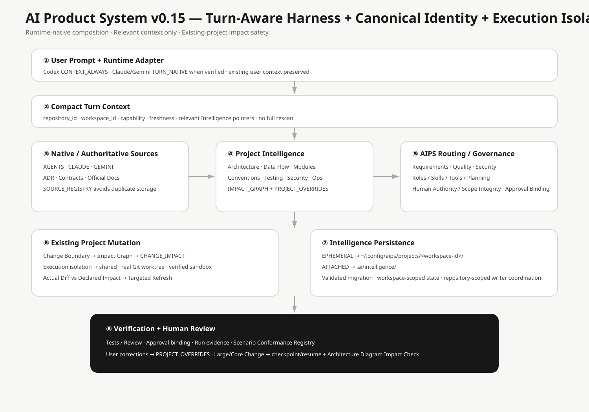

# 系統架構總覽

目前 AIPS 架構由 Turn-Aware Global Harness、Project Intelligence、Change Impact Guard、Enforceable Governance、Durable Run State、Scenario Conformance 與 Execution Isolation 組成。

## 1. Turn-Aware Global Harness

~~~text
User Prompt
→ Runtime-native integration
→ Compact Turn Context
→ Runtime/User Rules + Project Rules + Relevant Intelligence + AIPS Protocol
→ Agent Planning
~~~

Codex 以 CONTEXT_ALWAYS 為目標；Claude Code / Gemini CLI 在 native Hook 可驗證時提供 TURN_NATIVE。

## 2. Project Intelligence

第一次 Existing Project 需要廣泛理解或修改時，先 Read-only Bootstrap，再完成 Architecture / Data Flow / Modules / Contracts / DB / Events / Consumers / Conventions / Tests / Security / Operations 的 semantic enrichment，最後才 READY。

後續 Turn 只讀 relevant Intelligence；watched source 真正受影響時才 Targeted Refresh。

## 3. Canonical Project Identity + EPHEMERAL / ATTACHED

~~~text
Repository lineage
→ repository_id
   ├─ main worktree    → workspace_id A
   ├─ feature worktree → workspace_id B
   └─ AIPS worktree    → workspace_id C
~~~

Project Intelligence 與 Run State 使用 workspace_id；Execution Isolation 的 Single Writer coordination 使用 repository_id + Change Boundary。

EPHEMERAL 不在 Project 建立 .ai/，Intelligence / Runs 可存在 AIPS External Cache；ATTACHED 使用 .ai/intelligence/ + .ai/runs/。Attach/Detach 會 validated migrate/sync。

## 4. Existing Project Mutation

~~~text
Current Prompt
→ Relevant Intelligence
→ Change Boundary
→ IMPACT_GRAPH
→ CHANGE_IMPACT
→ Preserve Valid Native Conventions
→ Implementation
→ Tests / Review
→ Actual Diff vs Declared Impact
→ Targeted Intelligence Refresh
~~~

## 5. Quality-aware Product Delivery

完整產品交付主生命週期維持 LOCAL_COMPLETE → optional Production Enablement → PRODUCTION_VERIFIED。

## 6. Installation Lifecycle

Uninstall 只移除 AIPS-owned Managed Blocks / Hooks / Extensions / CLI。User instructions、Skills、Project source、.ai/ 與 External Project Intelligence 預設保留。

## 7. Architecture Diagram Impact

架構文件描述目前系統狀態；版本歷史與各版影響範圍集中在 CHANGELOG / Release Notes。Large/Core Change 仍必須在 Documentation Impact Gate 中判斷 Mermaid 與 Human SVG 是否受影響。

## 8. Enforceable Governance

~~~text
Human Approval
→ machine-readable Approval Record
→ canonical scope fingerprint
→ Runtime pre-tool guard（若該 Runtime 可驗證）
→ match: allow
→ mismatch/missing: APPROVAL_STALE / block
~~~

Context capability 與 Governance Enforcement 分開呈現。這不增加新的 Approval Gate，也不把批准權交給 Agent。

## 9. Durable Run State

~~~text
material step
→ CHECKPOINT.yaml + EVENTS.jsonl
→ interrupted / new Agent session
→ compare recorded workspace fingerprint with current identity / HEAD / branch / dirty state
→ CURRENT: resume from checkpoint
→ STALE: refresh/revalidate before continuation
~~~

這個機制沿用既有 Workspace State；不導入新的 workflow framework，也不把對話逐字稿當成持久狀態。

## 10. Scenario Conformance

~~~text
Scenario specification
→ coverage registry
→ evidence type
→ deterministic conformance check
→ coverage report
~~~

AIPS 不再用「Scenario 檔案存在」推論 automated coverage。Legacy Scenario 沒有明確一對一 evidence 時會誠實維持 manual。需要 Agent 語意判斷的 Scenario 使用 provider-neutral Agent Eval：只保存 observable response，Case fingerprint 改變時舊 Result 會失效，不保存 Chain-of-Thought。

## 11. Execution Isolation

~~~text
Execution Profile
→ shared
   → 使用既有 workspace
   → isolated=false

→ worktree
   → 真正的 Git worktree
   → AIPS external ownership record
   → 同一 Change Boundary 單一 ACTIVE writer

→ sandbox
   → 需要可驗證 provider
   → 沒有 provider 時 UNSUPPORTED / BLOCKED
~~~

AIPS 不會用 temp directory 假裝成 sandbox。Worktree cleanup 只處理 AIPS-owned managed path；若存在未提交修改會停止並保留 workspace。Clean worktree 可移除，但其 branch 預設保留，避免隱性刪除已提交成果。

v0.14 的 Architecture Diagram Impact：system-overview 與 system-lifecycle 受影響並更新；Harness、Project Intelligence、Product Delivery 本身的流程沒有改變，因此其專用圖為 N/A。
