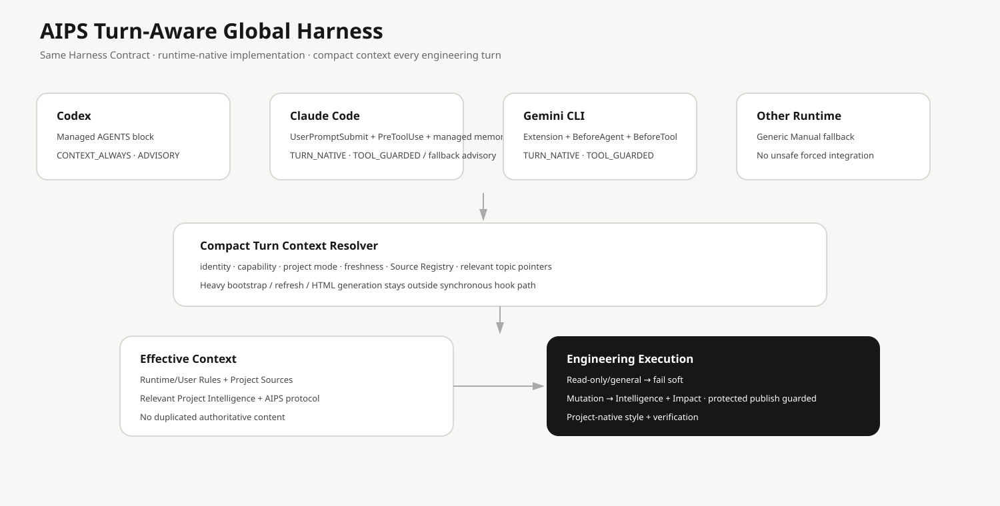

# Global Harness 與 Agent Adapter

AIPS v0.8 的 Global Harness 讓支援的 AI Agent Runtime 在 Session 啟動時先取得極小的 AIPS Bootstrap，而不是要求使用者每次手動貼 AIPS 提示詞。

## 核心概念

~~~text
Codex / Claude Code / Gemini CLI / supported runtime
                    ↓
            Runtime Adapter
                    ↓
          Minimal AIPS Bootstrap
                    ↓
          Harness Resolve
                    ↓
     Runtime + Project Instructions
                    ↓
        AIPS Orchestration
          （需要時才啟用）
~~~

AIPS 不把整個 Repository 塞進每個 Agent 的 Context。

## Harness Always Available，Orchestration Only When Applicable

一般知識聊天可正常回答；軟體 / 產品 / 專案工作才進入 Project Resolution、Instructions、Knowledge、Planning、Execution、Review。

## Runtime Adapter 是什麼？

不同 Agent 的啟動機制不同，因此 AIPS 不用一個 Global AGENTS.md 強行覆蓋所有 Runtime。

Adapter 只負責 Detect Runtime、安全 Bootstrap、Runtime-native instruction pointer、Verification 與 Uninstall。真正的 Planning / Security / Quality / Delivery 仍由 AIPS Core 負責。

## 為什麼有 MANUAL？

安全原則優先於表面的 100% 自動化。若 ~/.claude/CLAUDE.md 等使用者檔案已存在，AIPS 不會 append/import 自己，而是保留原檔並標示 MANUAL。

## Instruction Composition

~~~text
Platform / Safety
+ AIPS Governance
+ Current User Request
+ Runtime-native Instructions
+ Project AGENTS / ADR / Contracts / Docs
+ Project Knowledge
+ Project Skills
+ AIPS Skills
~~~

Native Runtime 若有自己的強制 precedence，AIPS 會遵守該 Runtime，而不是宣稱能突破平台規則。

## EPHEMERAL Project

只安裝 AIPS 不代表 AIPS 可以到處建立 .ai/。未 Attach 時是 EPHEMERAL；需要持久 Project State 才執行 aips attach /project 變成 ATTACHED。

## Ownership

AIPS 安裝的資源都必須 namespaced、記錄 ownership、可驗證、可逆，且不碰使用者既有內容。

Ownership Manifest：~/.config/aips/harness/installation.yaml

## 查看目前狀態

~~~bash
aips harness status
aips harness doctor
~~~

## Debug 某個 Session / Project

~~~bash
aips harness resolve --runtime codex --cwd "$PWD"
~~~

輸出會提供 Harness、Runtime、Adapter、Project Root、EPHEMERAL / ATTACHED、Project Instructions、Runtime-native Instructions、Project Knowledge、AIPS root/version。

## 安裝與解除

一般使用者使用 aips install / aips uninstall 即可；Harness 子命令主要給 Debug / 進階管理使用。

完整流程請看 docs/INSTALLATION.md。
