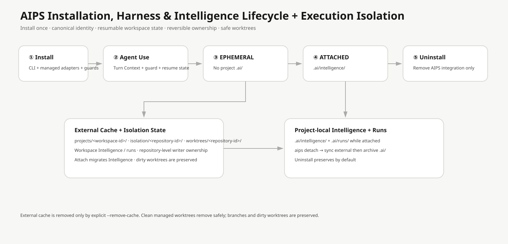

# 安裝與解除

本文件說明 AI Product System（AIPS）的完整安裝、Global Harness、Project Mode、更新與解除流程。

## 1. 安裝後會發生什麼？

~~~text
AIPS System / Global Harness
        │
        ├─ Runtime Adapters
        └─ AIPS Core
             │
             ▼
       Project (optional Attach)
~~~

aips install 會建立 AIPS 專用 .venv、CLI symlink、~/.config/aips、Harness Ownership Manifest，偵測 Agent Runtime，並只在不需覆寫使用者既有設定時建立 AIPS-owned Adapter。

## 2. 安裝

~~~bash
mkdir -p ~/Developer
cd ~/Developer
gh repo clone LucasLu3918/ai-product-system
cd ai-product-system
./scripts/bootstrap.sh
~~~

也可直接執行 ./bin/aips install。

安裝完成後：

~~~bash
aips doctor
aips harness status
aips harness doctor
~~~

如果 `~/.local/bin/aips` 已存在且不是目前 AIPS installation 擁有的 symlink，安裝會停止並保留原檔，不會強制覆寫。

如果 ~/.local/bin 不在 PATH：

~~~bash
export PATH="$HOME/.local/bin:$PATH"
~~~

## 3. 不會修改哪些東西？

AIPS 的重要不變條件：Install / Update / Uninstall 不應覆寫、改寫、刪除或接管使用者原本的 Agent Instructions、Skills 或 Project Source。

預設保護：

~~~text
使用者 AGENTS.md / AGENTS.override.md
~/.claude/CLAUDE.md
~/.gemini/GEMINI.md
Agent Runtime config/settings
User custom Skills
Project custom Skills
Project AGENTS / CLAUDE / GEMINI
Project source code
~~~

如果 Codex / Claude Code 的自動接入需要占用一個已存在的使用者 instruction file，AIPS 會保留原檔、完全不修改，並把 Runtime Coverage 設為 MANUAL。

## 4. Runtime Adapter Coverage

~~~bash
aips harness status
~~~

狀態：AUTOMATIC（安全自動載入）、MANUAL（偵測到但不改使用者檔）、NOT_DETECTED、CONFLICT、ERROR。

Coverage 是這台機器的實際狀態，以 aips harness status 為準。其他尚無專用 Adapter 的 Runtime 可使用 `harness/adapters/generic/BOOTSTRAP.md` 手動接入；AIPS 不會修改未知 Runtime 的底層設定來追求表面上的全自動。

### Codex CLI

若 Codex 已安裝且 $CODEX_HOME/AGENTS.md（預設 ~/.codex/AGENTS.md）不存在，AIPS 可建立最小 AIPS-owned Global Bootstrap；若已存在則保留並標示 MANUAL。

### Claude Code

若 Claude Code 已安裝且 ~/.claude/CLAUDE.md 不存在，AIPS 可建立最小 AIPS-owned Bootstrap；若已存在則保留並標示 MANUAL。

### Gemini CLI

優先使用 Gemini CLI 官方 Extension 機制，以 aips-global-harness namespaced extension 接入，不修改使用者 GEMINI.md。

## 5. 日常 Agent 使用

Runtime 為 AUTOMATIC 時：

~~~text
啟動原本 Agent
→ AIPS Minimal Bootstrap
→ 判斷是否為軟體 / 專案任務
→ 需要時才進入 AIPS Orchestration
~~~

一般聊天不會被迫跑 Planning；軟體工作會進入 AIPS；專案原本的 instructions 會一起解析。

## 6. EPHEMERAL 與 ATTACHED

AIPS 安裝不代表每個 Project 都要 Attach。

沒有 .ai/ 時為 EPHEMERAL：可使用 AIPS 規劃/審查，但不建立永久 Workspace。

需要 Project Knowledge / State 時：

~~~bash
aips attach /path/to/project
~~~

之後為 ATTACHED，才允許保存 .ai/STATE.yaml、.ai/MANIFEST.yaml、.ai/knowledge/、runs / decisions / events。

舊的 aips init /path/to/project 仍等同 Attach。

## 7. Preflight

~~~bash
aips preflight /path/to/project
~~~

會確認 AIPS System repo clean/main、fetch origin/main、只做 git pull --ff-only、阻擋 divergent history、Major Version 需要 --allow-major、重新執行新版 CLI 與 Validator。

v0.8 起，Project 沒有 .ai/ 時 Preflight 保持 EPHEMERAL，不會隱式 Attach。只有 ATTACHED Project 才更新 .ai/SYSTEM.yaml provenance。

## 8. Harness Resolver

~~~bash
aips harness resolve --cwd "$PWD"
~~~

或：

~~~bash
aips harness resolve --runtime codex --project /path/to/project
~~~

輸出 Runtime、Project Root、Project Mode、Instructions、Knowledge / State pointer 與 AIPS System pointer。

## 9. Harness Doctor

~~~bash
aips harness doctor
~~~

檢查 Bootstrap、Ownership Manifest、AIPS-owned Codex / Claude bootstrap ownership，以及 Gemini extension 是否可驗證。

## 10. Detach Project

~~~bash
aips detach /path/to/project
~~~

採可恢復 Detach：.ai/ → .ai.detached-YYYYMMDD-HHMMSS/，不刪 Product source。

## 11. 解除 AIPS

~~~bash
aips uninstall
~~~

或：

~~~bash
./scripts/uninstall.sh
~~~

流程：

~~~text
Read Ownership / Adapter state
→ remove/unregister AIPS-owned Runtime integrations
→ only remove unchanged AIPS-owned bootstrap files
→ preserve modified/conflicting files
→ remove Harness registry/config
→ remove AIPS CLI symlink
~~~

解除後保留：

~~~text
✓ 使用者 Agent instructions
✓ 使用者 custom Skills
✓ Project instructions / Skills
✓ Product source
✓ Project .ai/ / .ai.detached-* Workspace
✓ AIPS Git Repository
✓ AIPS .venv（預設）
~~~

如果某個 AIPS-owned bootstrap file 在安裝後被修改，Uninstall 會保留並警告，不會直接刪除。若某個 AIPS-owned Runtime registration 無法安全解除，Uninstall 會停止並保留 Ownership state，讓使用者修復後重試，而不是遺失追蹤資訊。

## 12. 連 .venv 一起解除

~~~bash
aips uninstall --remove-venv
~~~

或 ./scripts/uninstall.sh --remove-venv。

## 13. 完整本機移除

先執行 aips uninstall --remove-venv；確認 Project Workspace 後，由使用者自行 rm -rf ~/Developer/ai-product-system。AIPS 不會在執行中的 Uninstall 自我刪除 Git Repository。

## 14. 從 v0.7 升級到 v0.8

若使用 `aips preflight <project>` 從 v0.7 升級，舊 CLI 完成更新後會 re-exec 新版 v0.8 CLI；新版會偵測既有 AIPS installation 並安全建立/刷新 Global Harness。

若只從 v0.7 執行一次 `aips update`，舊版 process 本身無法在同一個 process 內執行尚未載入的 v0.8 Harness 邏輯；更新完成後請執行一次：

~~~bash
aips install
~~~

或在下一次 `aips preflight` 時完成 Harness migration。過程仍遵守「不覆寫使用者既有 Agent instructions / Skills」規則。

## 15. 重新安裝

Repository 尚在時回到 repo 執行 ./scripts/bootstrap.sh；若已刪除則重新 clone 後執行 bootstrap。原 Project 不需重建。

## 16. 常用指令

~~~text
System
  ./scripts/bootstrap.sh
  aips install
  aips update
  aips doctor
  aips validate
  aips uninstall

Harness
  aips harness install
  aips harness uninstall
  aips harness status
  aips harness doctor
  aips harness resolve

Project
  aips attach <project>
  aips status <project>
  aips preflight <project>
  aips detach <project>
~~~
