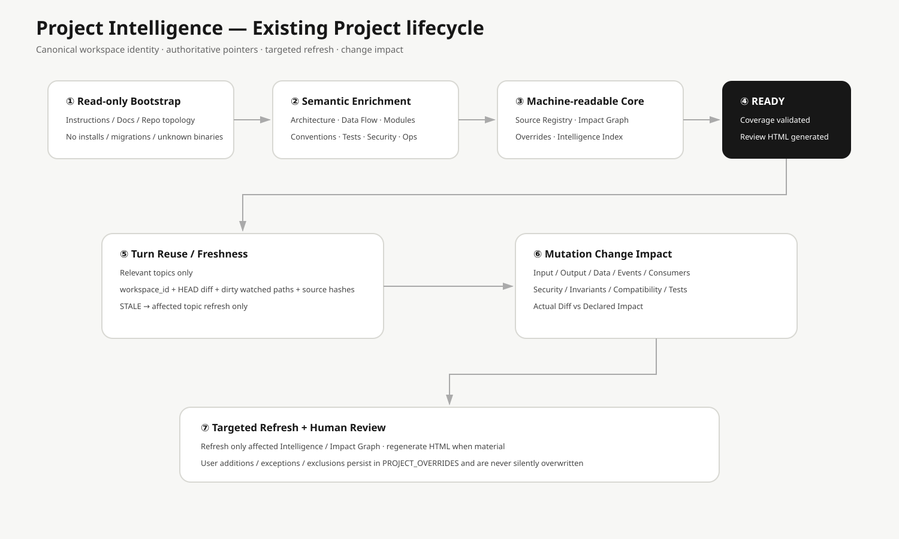

# Project Intelligence 使用指南

Project Intelligence 是 AIPS 對既有專案建立的可重用理解層。

## 第一次 Existing Project

Read-only Discovery 先建立 PARTIAL，再由 Agent 針對 Architecture、Data Flow、Modules、Contracts、DB/Events、Conventions、Testing、Security、Operations 做 evidence-based semantic enrichment；通過 finalize 才是 READY。

## 不重複正式文件

已有 AGENTS / CLAUDE / GEMINI / ADR / OpenAPI / Architecture Docs / Brand / Visual / Quality Artifact 時，只存 Pointer/Metadata。SOURCE_REGISTRY 同時記錄 Runtime visibility。

## 四份核心 Machine-readable 檔

- `PROJECT_INTELLIGENCE.yaml`：Identity / Branch / Worktree / State / Topic pointers。
- `SOURCE_REGISTRY.yaml`：Authoritative source / Scope / Hash / Runtime visibility。
- `IMPACT_GRAPH.yaml`：API / Module / DB / Event / Consumer graph。
- `PROJECT_OVERRIDES.yaml`：使用者核准、補充、例外、排除、Conflict。

## 三軸狀態

~~~yaml
readiness: READY | PARTIAL | BLOCKED
review: UNREVIEWED | REVIEWED | CHANGES_REQUESTED
freshness: CURRENT | STALE
~~~

## Human Review HTML

ATTACHED 位於 `.ai/intelligence/reviews/PROJECT_INTELLIGENCE_REVIEW.html`；EPHEMERAL 位於 AIPS External Cache。HTML self-contained、deterministic，只是 Review View。

## Freshness

不是任何 Commit 都全量 STALE。AIPS 比較 relevant Source Hash、watched paths、HEAD diff、dirty paths、Branch/Worktree 與 Schema，只 Targeted Refresh 受影響 Topic。

## Attach / Detach

Attach 將 External Intelligence validated migrate 到 `.ai/intelligence/`；Detach 先 validated sync 回 External Cache，再封存 `.ai/`。

## Change Impact

Mutation 前建立 CHANGE_IMPACT，涵蓋 Input / Output / Data / Events / Consumers / Security / Invariants / Compatibility / Tests；實作後以 Actual Diff 回頭核對。

## Preserve Valid Native Conventions

Explicit Rule → Formatter/Linter/Contract → Shared Abstraction → Majority Convention → Approved Intelligence → Framework Best Practice → AIPS Default。Unsafe/broken legacy pattern 不盲目複製。

## Sensitive Data

Intelligence / HTML 不保存實際 Password、Token、Private Key、Secret env value、Credential 或不必要的敏感 Payload。

## Monorepo

採 System-level + Target Component + Shared Impact relationships 的 Lazy Load，不因整體理解就載入所有 Component。

## Debug

一般使用不需執行；排錯可用 `aips intelligence status/render/finalize/impact-init`。

## Identity namespace

Project Intelligence follows `orchestration/PROJECT_IDENTITY.md`. EPHEMERAL storage is workspace-scoped by canonical `workspace_id`; repository-wide writer coordination belongs to the isolation layer and uses `repository_id`.
