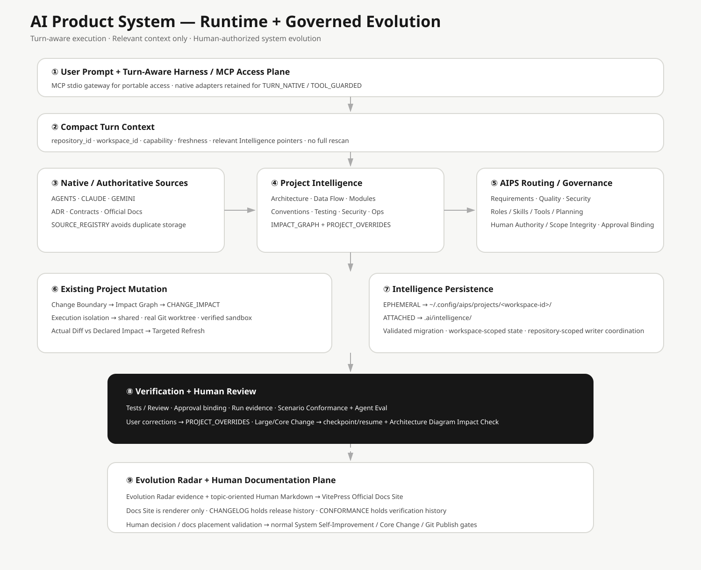
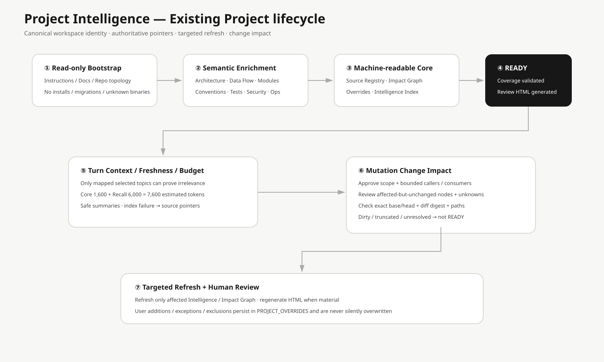
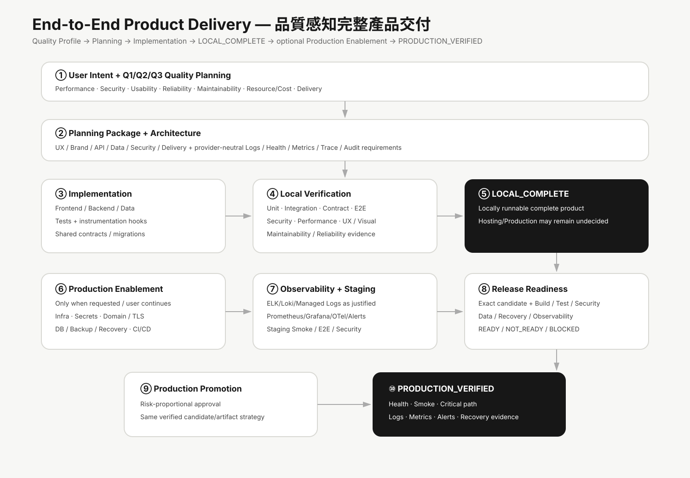

# 系統架構總覽

目前 AIPS 架構由 Turn-Aware Global Harness、Project Intelligence、Change Impact Guard、Enforceable Governance、Durable Run State、Scenario Conformance、Execution Isolation、Evolution Radar maintenance plane 與 Documentation Consistency Contract 組成。

完整技術與中英文專有名詞可由 [`TECHNOLOGY_GUIDE.html`](TECHNOLOGY_GUIDE.html) 閱讀；Evolution Radar 的 Human 圖解流程見 [`EVOLUTION_RADAR_OVERVIEW.html`](EVOLUTION_RADAR_OVERVIEW.html)。

## 1. Turn-Aware Global Harness

~~~text
User Prompt
→ Runtime-native integration
→ Compact Turn Context
→ Runtime/User Rules + Project Rules + Relevant Intelligence + AIPS Protocol
→ Agent Planning
~~~

Codex 以 CONTEXT_ALWAYS 為目標；Claude Code / Gemini CLI 在 native Hook 可驗證時提供 TURN_NATIVE。

## Just-in-Time Retrieval Intelligence

Project Intelligence 現在分成兩個互補層次：穩定的 Architecture / Source Registry / Impact Graph / Overrides，以及可重建的即時 Retrieval cache。Agent 每次工作先依任務查詢 code、symbols、tests、Impact Graph 與 Git history，再經 ranking 與 token budget 只帶入必要 evidence。Retrieval cache 不具有治理 authority，缺少 optional semantic provider 時會退回 deterministic/local lanes 與既有 Project Intelligence。

## 2. Project Intelligence

第一次 Existing Project 需要廣泛理解或修改時，先 Read-only Bootstrap，再完成 Architecture / Data Flow / Modules / Contracts / DB / Events / Consumers / Conventions / Tests / Security / Operations 的 semantic enrichment，最後才 READY。

後續 Turn 只讀 relevant Intelligence；watched source 真正受影響時才 Targeted Refresh。

## 3. Canonical Project Identity + EPHEMERAL / ATTACHED

~~~text
Repository lineage
→ repository_id
   ├─ main worktree    → workspace_id A
   ├─ feature worktree → workspace_id B
   └─ AIPS worktree    → workspace_id C
~~~

Project Intelligence 與 Run State 使用 workspace_id；Execution Isolation 的 Single Writer coordination 使用 repository_id + Change Boundary。

EPHEMERAL 不在 Project 建立 .ai/，Intelligence / Runs 可存在 AIPS External Cache；ATTACHED 使用 .ai/intelligence/ + .ai/runs/。Attach/Detach 會 validated migrate/sync。

## 4. Existing Project Mutation

~~~text
Current Prompt
→ Relevant Intelligence
→ Change Boundary
→ IMPACT_GRAPH
→ CHANGE_IMPACT
→ Preserve Valid Native Conventions
→ Implementation
→ Tests / Review
→ Actual Diff vs Declared Impact
→ Targeted Intelligence Refresh
~~~

## 5. Quality-aware Product Delivery

完整產品交付主生命週期維持 LOCAL_COMPLETE → optional Production Enablement → PRODUCTION_VERIFIED。

## 6. Installation Lifecycle

Uninstall 只移除 AIPS-owned Managed Blocks / Hooks / Extensions / CLI。User instructions、Skills、Project source、.ai/ 與 External Project Intelligence 預設保留。

## 7. Architecture Diagram Impact

架構文件描述目前系統狀態；版本歷史與各版影響範圍集中在 CHANGELOG / Release Notes。Large/Core Change 仍必須在 Documentation Impact Gate 中判斷 Mermaid 與 Human SVG 是否受影響。

## 8. Enforceable Governance

~~~text
Human Approval
→ machine-readable Approval Record
→ canonical scope fingerprint
→ Runtime pre-tool guard（若該 Runtime 可驗證）
→ match: allow
→ mismatch/missing: APPROVAL_STALE / block
~~~

Context capability 與 Governance Enforcement 分開呈現。這不增加新的 Approval Gate，也不把批准權交給 Agent。

## 9. Durable Run State

~~~text
material step
→ CHECKPOINT.yaml + EVENTS.jsonl
→ interrupted / new Agent session
→ compare recorded workspace fingerprint with current identity / HEAD / branch / dirty state
→ CURRENT: resume from checkpoint
→ STALE: refresh/revalidate before continuation
~~~

這個機制沿用既有 Workspace State；不導入新的 workflow framework，也不把對話逐字稿當成持久狀態。

## 10. Scenario Conformance

~~~text
Scenario specification
→ coverage registry
→ evidence type
→ deterministic conformance check
→ coverage report
~~~

AIPS 不再用「Scenario 檔案存在」推論 automated coverage。Legacy Scenario 沒有明確一對一 evidence 時會誠實維持 manual。需要 Agent 語意判斷的 Scenario 使用 provider-neutral Agent Eval：只保存 observable response，Case fingerprint 改變時舊 Result 會失效，不保存 Chain-of-Thought。

## 11. Execution Isolation

~~~text
Execution Profile
→ shared
   → 使用既有 workspace
   → isolated=false

→ worktree
   → 真正的 Git worktree
   → AIPS external ownership record
   → 同一 Change Boundary 單一 ACTIVE writer

→ sandbox
   → 需要可驗證 provider
   → 沒有 provider 時 UNSUPPORTED / BLOCKED
~~~

AIPS 不會用 temp directory 假裝成 sandbox。Worktree cleanup 只處理 AIPS-owned managed path；若存在未提交修改會停止並保留 workspace。Clean worktree 可移除，但其 branch 預設保留，避免隱性刪除已提交成果。

## 12. Evolution Radar Maintenance Plane

~~~text
Scheduled / Manual Radar Trigger
→ bounded public source collection
→ provenance + normalization + deduplication
→ weekly evidence Issue
→ monthly recurrence roll-up
→ reliable semantic analyzer available?
   ├─ no  → ANALYSIS_PENDING
   └─ yes → evidence-digest + repository-revision bound analysis
              ↓
          advisory recommendation
              ↓
          Human Decision Binding
          REJECT / HOLD / ASSESS / TRIAL / ADOPT
              ↓
          normal System Self-Improvement / Core / Git Publish gates
~~~

Evolution Radar 位於 maintenance plane，不在一般 Agent Turn 的 runtime hot path。Radar / Decision workflow 維持 `contents: read` + `issues: write`，沒有 remote code-write、implementation PR、merge 或 release authority。Scheduled analyzer 使用 read-only permission profile；Human-approved Trial 只在 ephemeral AIPS-managed worktree 取得 workspace mutation 能力，checkout credentials 不持久化。

Semantic Analysis 是 provider-neutral contract：可靠 analyzer 必須把判斷綁定 exact evidence digest + repository revision；沒有可靠 analyzer 就保持 `ANALYSIS_PENDING`。Human Decision 進一步綁定 candidate、evidence、baseline revision、scope、actor/time 與 decision fingerprint。當 baseline 已 STALE，正向的 ASSESS / TRIAL / ADOPT 必須 fail closed。

`TRIAL` 的 next action 是 `controlled_trial_execution`：Human 必須提供 approved scope + approved paths，系統建立 worktree 執行 bounded experiment，之後以 forbidden-path / path-scope / diff-size / no-commit / repository validation 產生 Trial Report。Trial PASS 仍不會自動 Adopt；若 Human 之後選擇 ADOPT，可把 exact PASS Trial fingerprint 綁到新的 ADOPT Decision，確認 candidate / signal / baseline 一致後才 handoff 到 System Self-Improvement Review。

## 13. Documentation Consistency Contract

~~~text
Behavior-bearing technical change
→ Git changed files
→ config/documentation-sync.yaml
→ mapped Human Docs + Agent Docs
→ Technology Guide review
→ repository validation
   ├─ complete → continue
   └─ missing  → FAIL
~~~

`orchestration/DOCUMENTATION_SYNC.md` 定義 Agent/Maintainer contract；`docs/human/DOCUMENTATION_SYNC.md` 提供 Human 說明。Validator 透過 `scripts/documentation_sync.py` 檢查 changed-path mapping，確保設定範圍內的程式、協定、模板、設定或 workflow 異動時，對應 Human / Agent 文件與 `docs/human/TECHNOLOGY_GUIDE.html` 一起進入同一個 change。`scripts/documentation_audience.py` 另確保 Human-only permanent docs 位於 `docs/human/`，`docs/` root 只保留 allowlisted shared canonical docs。

這是既有 Documentation Impact Gate 的 deterministic enforcement，不新增 Human Approval Gate。Deterministic check 能證明文件有被同步 review/update，但 prose 是否語意正確仍由 Author / Reviewer 負責。

## 14. Human Technology Guide

[`TECHNOLOGY_GUIDE.html`](TECHNOLOGY_GUIDE.html) 是 Human 一頁式技術總覽，以中英文整理 AIPS 的主要技術、架構概念、用途、可用情境與關聯文件。它本身受 Documentation Consistency Contract 維護，因此後續新增或修改設定範圍內的技術實作時，CI 會要求同一 change 重新 review/update 這份總覽。

本次 Architecture Diagram Impact：Evolution Radar Human inline SVG、本架構總覽與 Human Documentation Namespace 說明受影響並更新；既有 `system-overview.svg` 高階 topology 未改變，Harness、Project Intelligence、Product Delivery、Installation lifecycle 專用 SVG 亦未改變，因此這些 SVG 為 N/A。

## 15. Human Documentation Namespace

~~~text
Repository root conventions
├─ README.md / CHANGELOG.md / SECURITY.md
├─ docs/
│  ├─ ARCHITECTURE.md        ← shared Human + Agent canonical source
│  └─ human/
│     ├─ Documentation Map
│     ├─ User / Install / Harness guides
│     ├─ Architecture Overview + assets
│     ├─ Evolution Radar guides
│     └─ Technology Guide
├─ orchestration/            ← Agent canonical protocols
├─ harness/                  ← Runtime contracts
└─ config / templates        ← machine contracts
~~~

永久 Human-only 文件由 `config/documentation-audience.yaml` 管理。若獨立 Human report 必須持久存在其他位置，需在 `standalone_human_documents` 明確登記並使用 `HUMAN_` prefix；不建立平行 `docs/agent/`，避免第二份 Agent canonical source。
