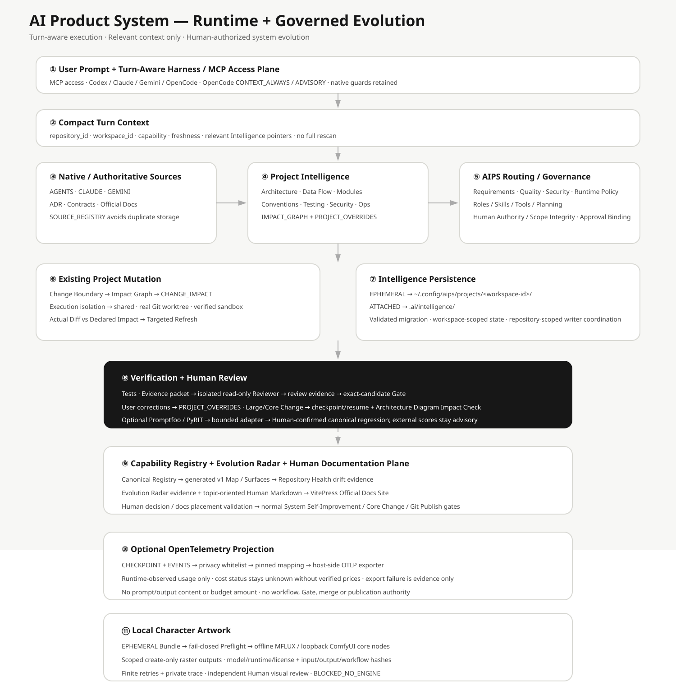
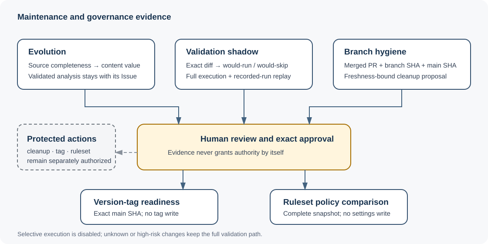

# 系統架構總覽

AIPS 是跨 Agent Software Engineering Harness。這份文件只描述**目前架構**；版本歷史放 CHANGELOG，Scenario 證據歷史放 Conformance。

## Runtime 與接入層

Creative prompt compiler 與共用錯誤類別屬於既有 Python executor 的內部模組；`creative_execution` 相容 facade 保留原有呼叫與輸出，不新增 OpenCode 權限或工具簽名。

OpenCode 的 local creative tool 有獨立 `review-assist` action grant，綁定目前 Session root；它只授權本機視覺建議，不能改變 Human review 或 user acceptance。

OpenCode V2 每則使用者回覆都重新建立目前動作授權；有界 Session 狀態只支援短風格選擇，並與 Harness Context、原生檔案決策分開。創作執行仍需明確工具動作及本機 preflight。

OpenCode 的 Context、admission、permission 與 Shell hooks 使用非同步程序呼叫及有限輸出；同一 Session 的 Context 可短暫共用結果，permission 決策仍會重新讀取。Project Diagnostics 只提供下一步與復原指引，不會替人執行修復。

OpenCode V2 captures Creative mutation authority at native prompt admission; its Session-root grant is independent of dispatch Context and is revoked by the next prompt.

診斷回報的 Runtime/Harness 狀態是設定與靜態觀測；沒有版本綁定的原生測試時，不代表 Context、Hook 或 Tool 已在 Host 內生效。

OpenCode 與 CLI 共用本機模型能力表；Z-Image Turbo 的新增 generate 配對會同時出現在 discovery、configure 與 preflight。

OpenCode 的 Creative tool 仍使用同一個本機 executor；ComfyUI Z-Image profile 固定 split-loader topology，並在 preflight 驗證權重清單與清除輸出 PNG 的 prompt text metadata。

OpenCode 創作 tool 支援 discover/configure，產圖意圖、原生檔案 guard 與 Shell effect policy 維持不同檢查；重新投影後仍須驗證實際 host hooks。

Discovery distinguishes installed command, responsive runtime, local model catalog, Bundle preflight and real inference. The ordinary ComfyUI probe is fixed to `127.0.0.1:8188`; static Apple Silicon FP8 evidence stays advisory.

Native Context envelope 驗證與 user-only 授權分開處理；只檢查設定的要求仍可執行 discover/preflight，不會啟動生成。

OpenCode V2 derives creative mutation grants from the current native prompt admission; dispatch Context is advisory and never grants authority. Its explicit creative executor and resumable multi-item workflow share the CLI execution boundary.

OpenCode V2 的 AIPS Plugin 以 Session directory 裝載精簡 Turn Context，並在原生檔案權限前重查目標；另提供綁定 EPHEMERAL Session 的 Creative 工具。任意 Shell 子程序仍不宣稱受保護。

Runtime adapters distinguish malformed hook input from a valid request with no applicable action. Resolution failures carry stable machine-readable status and reason codes, while diagnostics remain on stderr so callers can safely parse stdout.

Portable Commands 以 Canonical ID（例如 `aips.plan`）將同一治理工作流渲染為 Slash Command、Skill 或 generic MCP bootstrap；它是 advisory access plane，不取代 Runtime-native Adapter 的 turn hook 或 pre-tool guard。

~~~text
User Prompt
→ MCP Access Plane 或 Runtime-native Adapter
→ Compact AIPS Context
→ Host Agent semantic reasoning
→ deterministic AIPS helpers / governed execution
~~~

MCP 提供 portability；native adapters 提供 runtime hook / guard。兩者共用 canonical Roles、Skills、Orchestration 與 Project Intelligence。完整 MCP Host 使用 Resources／Prompts／Tools；tool-only Host 透過唯讀 capability/workflow Tools 取得同一 canonical context。各 runtime 的 enforcement 依實際覆蓋證據分開標示。

OpenCode V2 的 managed plugin 在 primary model dispatch 前注入精簡 Turn Context，並在 permission evaluation 階段檢查支援的直接檔案操作。L1 僅允許非 Git workspace 中受限路徑的新創意資產；L2 需要 Project Intelligence READY、freshness CURRENT 與無待解權威衝突；L3 外部效果沿用既有 Human approval gate。Shell 僅保留有限唯讀命令，並額外提供固定參數的 AIPS 診斷。`creative_execution` 是唯一有界自訂工具：它綁定當前 EPHEMERAL Session，可建立不覆寫的角色／風格 Profile 與未設定引擎的 Creative Bundle，也可對既有 Bundle 執行唯讀預檢及明確要求的本機生成。其他 MCP/custom tools 和繞過 OpenCode 的寫入仍不在 guard 範圍。Plugin 安裝與 hook discovery 不足以證明執行防護；完成 runtime permission acceptance 前，治理保持 ADVISORY。

## Project Intelligence 與 Retrieval

Creative Impact Graph edges are currently incomplete; manually reviewed consumer paths keep this change scoped and do not imply repository-wide graph coverage.

高風險既有專案變更先以 Change Impact 遍歷明確的 caller、consumer 與資料／事件邊界；scoped coverage 不會提升為 repository-wide 完整性。

Project Diagnostics points to read-only inspection or a conditional recovery action without running it.

Project Intelligence may route Creative work and identify affected consumers, but it cannot create or restore the native prompt grant used for file mutations.

`aips project diagnose <path>` 聚合既有 Project Intelligence、Harness 與 MCP 靜態檢查，提供原因碼與恢復指引；它不會建立索引、刷新或修改專案。診斷中的 Host 能力仍依原生證據維持 UNVERIFIED。

創作 manifest 的 Human visual review 與軟體獨立 review evidence 是不同契約。圖片容器或 tool fixture 通過不會自動產生視覺 PASS 或使用者接受。

創作可靠性 Core candidate 保留完整 Gate、媒材拒絕及取消授權回歸。損壞 PNG fixture 必須失敗；合成測試不能替代真實模型與人工品質驗收。

discover/preflight 是唯讀操作；configure 會建立版本化檔案，execute 才會啟動 provider。排程與狀態不可將這些不同效果混為完成產圖。

創作設定只允許固定欄位與 local provider，不修改來源 Bundle、不下載權重；取消要求後的短回覆不恢復生成授權。

creative_medium 是媒材檢查的 advisory 輸入，不能取代生成授權。影響分析包含設定版本、CLI/plugin consumers 與真實模型尚未驗證限制。

Creative Bundle preparation adds versioned, project-scoped outputs and does not mutate the target project's reusable Intelligence.

OpenCode V2 receives compact Turn Context from the existing Project Intelligence CLI; the plugin caches only derived context using bounded fingerprints and does not persist prompts.

Turn Context 固定使用精簡 `SYSTEM_CORE.md`，並依任務分類附上 canonical protocol routes；缺少必要路徑時修改任務 fail-closed，路由本身不授予任何核准或發布權限。

`aips intelligence temporal` 仍由 `scripts/project_intelligence.py` 提供；temporal query 的內部實作位於 `scripts/project_intelligence_temporal.py`，既有 facade、輸出與權限邊界不變。

Promotion eligibility 與目標路徑限制位於 `scripts/project_intelligence_promotion.py`，由同一 facade 使用；實際提升仍要求明確核准，拒絕覆寫既有目標。

執行環境恢復延伸既有 CLI 與 Retrieval：`runtime_cache.py` 共用可寫快取解析，`package_install.py` 回報安全的下載失敗分類；沒有新增遠端服務或治理權限，既有架構拓樸與圖不需改動。

Turn Context 在選取任務相關內容前，先依目標路徑與 Runtime 篩選指示來源；分類只協助路由。非 Git 或尚無 `HEAD` 的資料夾保留基本 Context，歷史斷言維持不可用。檢索讀取與索引寫入分開，在安全條件下可使用經檢查的唯讀暫時快照。

Squash merge 後的 revision refresh 只有在舊／新 Git tree 完全一致時可自動更新 metadata；tree 不同時維持 semantic refresh required，避免把內容變更誤標為 CURRENT。

Existing Project 第一次需要廣泛理解或修改時，先 read-only bootstrap，再建立 Architecture / Data Flow / Modules / Contracts / Tests / Security / Operations 等 stable Intelligence。

後續 Turn 以 Just-in-Time Retrieval 取得 task-relevant code、symbols、tests、Impact Graph 與 Git history；retrieval cache 可重建，不取得治理 authority。受限 runtime 若在 SQLite 建立唯讀連線後的首次查詢才失敗，仍可在沒有 live WAL 且來源穩定時使用經完整性檢查的暫時快照。索引落後目前 revision 時，刷新需要 SQLite cache 與 sidecar 可寫；寫入受限會回報獨立診斷，不會把舊索引當成最新。

修改既有專案時，Change Impact 會把 canonical Impact Graph、可重建的本機 lexical code relations 與本次 traversal evidence 分成三層。依風險設定 caller/consumer 深度與 node/edge 上限；結果會列出受影響但未修改的檔案供 review。Lexical 關係是候選而非編譯器解析結果；動態 dispatch、圖涵蓋不足、索引過期或預算截斷都會標成 unknown/incomplete，高風險情境不能據此宣稱完整。

`aips intelligence impact-candidates --seed-path <path>` 可從 Python imports、literal CLI dispatch、測試引用與文件 placement registry 產生有來源行號的唯讀候選。候選未經審閱不會進入 canonical Impact Graph；動態關係保持 unknown，全域 coverage 不會因此升級。

Temporal Project Intelligence 在既有層上增加 `TEMPORAL_ASSERTIONS.yaml`，以 Git revision ancestry 表達事實有效期間，以 provenance、observed metadata 與 supersession 表達架構演進。一般工作仍使用 Current Snapshot；只有歷史、backport、release branch 或 evolution 問題才執行 bounded temporal query。SQLite 只保存可重建投影，不是 canonical truth。

Turn Context 另以 deterministic L1 Project Core capsule 壓縮穩定摘要並保留 source digest/pointers；L2 提供 topic 與 bounded retrieval，L3 指向按需讀取的原始來源。Core capsule 是可重建衍生檢視，不取代權威文件或 temporal assertions；context-audit 以唯讀方式檢查 freshness、provenance 與衝突。

Retrieval persistence helpers now live in `scripts/retrieval_storage.py`; `scripts/retrieval_intelligence.py` remains the compatibility facade and preserves the existing callable exports. The index remains disposable and rebuildable.

## Project Identity 與 Persistence

~~~text
repository_id
├─ main workspace      → workspace_id A
├─ feature workspace   → workspace_id B
└─ AIPS worktree       → workspace_id C
~~~

EPHEMERAL 把 durable reusable state 放在 AIPS external cache；ATTACHED 才使用 project-local .ai/。

## Creative Workflow

Project Intelligence candidate reports remain read-only and cannot authorize creative execution or change canonical graph state.

Creative manifests distinguish workflow execution and raster validity from real model inference, Human visual review and user acceptance.

Profile-driven prompt compilation combines bundle intent with character acceptance criteria and style constraints, then records profile and compiled-prompt hashes. Model capability profiles provide advisory, evidence-ranked recommendations without changing the selected model. An optional review action sends a bounded image only to an already-installed local Ollama vision model over loopback and writes a separate advisory report; a Human still decides visual review and the user still records acceptance.

The deterministic prompt compiler and model recommendation logic are internal pure functions in `scripts/creative_prompt_compiler.py`; `scripts/creative_execution.py` remains their compatibility facade. Exact output fingerprints and function/class identity checks cover the extraction. This does not change the creative workflow or its architecture diagrams.

`aips project diagnose` 不會呼叫創作工具或產生圖片；Creative Profile、Provider 與視覺驗收流程仍由既有明確授權路徑負責。

Z-Image Turbo 可使用 MFLUX 專用命令 `mflux-generate-z-image-turbo`，或 ComfyUI 固定 split-loader 工作流；ComfyUI 會核對 UNET、CLIP、VAE 本機清單。兩種配對僅支援文字產圖，8 步可由 Bundle 明確設定，實際品質與人工驗收仍獨立記錄。

角色插畫新增唯讀 `discover` 與建立新版本的 `configure`，補齊本機引擎設定路徑。OpenCode 先正規化 Context，再判斷使用者要求與取消狀態；要求點陣插畫時不能默默改交 SVG。生成、圖片容器檢查、人工視覺審查與使用者接受分開記錄；沒有模型權重時仍不能宣稱真實產圖驗收。

Reusable character artwork extends the existing Creative Direction path: hashed local identity/style profiles feed optional installed MFLUX or loopback ComfyUI built-in workflows, separate create-only raster assets receive provenance validation, and a deterministic composer typesets the character sheet. Read-only discovery distinguishes command, runtime, model inventory, preflight and inference readiness; its ordinary ComfyUI check only contacts `127.0.0.1:8188`. Preflight never starts generation; unavailable engines return `BLOCKED_NO_ENGINE` with provider-specific reason codes and recovery guidance. On Apple Silicon, explicit FP8 metadata can raise a static advisory while real backend compatibility remains unverified. An independent human visual review checks identity and style fidelity. The helper does not infer quality or install/download image models.

The `creative_execution` path can prepare versioned Character/Style Profiles and an unconfigured Bundle before any engine is selected; its closed MFLUX registry fixes model/operation commands and bounds multi-reference edits to supported FLUX.2/Qwen operations. ComfyUI and FLUX.1 edits remain single-reference.

OpenCode V2 prompt admission issues a fresh transient grant for each user response. A short creative selection can use root-bound, expiring structured Session state with finite turns and remaining outputs; Context and retrieved Project Intelligence remain advisory, and raw prior prompts are not retained. Cancellation, unrelated work, scope expansion and output-cap exhaustion revoke continuation. The local `generate-set` workflow records each Bundle outcome and resumes only after verifying saved provenance hashes.

## Planning 與 Product Delivery

Creative visual-assistance findings remain advisory inputs to Human review and cannot stand in for the approved direction or acceptance decision.

Creative generation provenance and Human review are separate from workflow and raster checks.

OpenCode 的 `aips-plan` Command 使用既有 Planning 工作流與 Human Approval；原生入口不建立第二份規劃規則。

Plan21 Phase 2 centralizes deterministic JSON/hash, path and glob primitives behind existing facades; it does not change planning or product authority.

Turn Context 對規劃任務只選取相關 canonical planning 與 product-delivery protocols；任務路由不改變需求核准、Change Boundary 或 Human decision gates。

主要實作保留符合政策與能力條件的 Runtime／使用者選定模型；有證據、風險分析、Context 隔離或必要獨立審查價值時才委派。Skill frontmatter 透過決定性產生器輸出相容的 v1 INDEX；架構流程見 `../ARCHITECTURE.md`。

Runtime Context 共用驗證 Python 選擇與 runtime 路徑解析，讓 CLI、local validation 與 publication preflight 使用同一套能力判定。Scenario 198 以確定性矩陣覆蓋安裝型態、Python、cache、網路與平台組合。

大型產品先形成 Planning Package。可選的 `PLANNING_MANIFEST.yaml` 對 artifact 狀態、適用性、依賴與 requirement-to-artifact links 提供 deterministic structural validation；研究、產品方向、UX 與 domain/API 選擇仍由既有專業角色交叉審查。Gate 1 與 Gate 2 各自保留 Human approval。舊 package 沒有 manifest 時仍相容。產品生命週期維持：

Planning 階段可用 EARS 整理適合的功能需求，並透過可選的需求登錄檔連結需求、驗收條件與驗證方法；格式檢查與語義審查、執行證據各司其職。

~~~text
Plan
→ Local implementation
→ Tests / Security / Review
→ LOCAL_COMPLETE
→ optional Production Enablement
→ PRODUCTION_VERIFIED
~~~

Production、Git publication、merge 與 release authority 不因 Automation 或 MCP 而自動取得。

Implementation Resolution 位於 Project Intelligence / Planning 與既有工程角色之間。它將契約權威、專案證據、Human 確認的技術與架構決策、ownership 和品質要求整理為有來源的 Implementation Profile。REST/OpenAPI 實作證據驗證規格有效性、本機參照安全、canonical baseline 相容性、operation 測試覆蓋及證據 revision 新鮮度；未知差異維持待審，不會自動核准破壞性變更。

Phase 3 在同一流程核對確切候選的 Profile 指紋、語言 Profile、檔案所有權、生成檔輸入／輸出雜湊、必要專案命令證據及 OpenAPI 報告新鮮度。只有設定了適用路徑的既有 Integration Gate 才會強制執行；這些證據不代表 generator 已重跑，也不代替人類判斷測試斷言或契約變更。

Phase 4 在這條實作流程加入可選的 OpenAPI client generator adapter：預覽與 Gate 僅檢查，使用者在本機明確指定 `--execute` 才以固定的 repository-local tool 產生 transport/client 邊界。輸出只有符合 allowlist 且既有 ownership 雜湊仍有效時才會套用，並與 Profile provenance 一起原子更新。此 subprocess 不宣稱 OS sandbox，亦不替代語義測試。

Phase 5 的可選 `enforcement.generator_reports` 將未追蹤的 Phase 4 執行報告與目前 Profile、契約、工具、輸入、產物、Git 歷史及 Phase 3 provenance 交叉核對；舊 Profile 不受影響。共用 Widgets 參考專案執行本機 HTTP 服務與產生的 client，驗證工作流程及該案例行為。各真實產品的契約、測試和證據仍留在產品專案。

## Deterministic Execution

Project Intelligence relationship candidates are listed as review evidence under the existing capability; generated architecture surfaces remain projections of the canonical registry.

Prompt compilation is deterministic and fingerprinted; model rankings and local vision reports remain advisory and never change execution status or selected model.

Creative 延續狀態只容許有限回合與輸出數，不建立排程、背景重試或自動執行；取消、工作切換、範圍擴張或數量耗盡即撤銷延續。

The shared path inventory classifies safe roots and prefixes; planner-specific risk semantics remain independent and unknown paths select full validation.

CI 每次都安裝四份驗證 requirements 在 tested constraints 下鎖定的 Python 套件，因為必要的 repository lifecycle fixtures 會執行完整 CLI preflight。精確候選路徑仍決定是否安裝 Node、文件建置套件及 Playwright Chromium。

The Creative batch executor preflights each configured Bundle, records per-item results and verifies output/provenance hashes before resuming.

System Facts 與 Capability Registry 將 `aips project diagnose` 登錄為既有 `project` 命令下的唯讀診斷，未新增執行權限或狀態儲存。

Image generation remains a separate explicit action; the CLI preparation path is not scheduled as an autonomous task or retry loop.

The capability registry maps the local creative executor, Bundle template, lifecycle evidence, and Scenario to the existing Harness runtime surface. Execution is opt-in and output is create-only.

OpenCode is an existing Harness capability: its generated Skills, Session-root Context, native permission decisions, and lifecycle checks remain represented by the canonical Capability Registry and conformance evidence.

The OpenCode native helper uses L1 for confined new creative assets in non-Git workspaces, L2 for READY/CURRENT project mutations, and L3 for external effects under the existing Human approval gate.

OpenCode Skills 由 canonical Skill Registry 生成；description、source digest 與 ownership 的一致性由 deterministic lifecycle 驗證。

CI 的 Python 驗證套件是完整 repository lifecycle 的固定執行前提，與精準路徑計畫選擇的 Node 設定、Chromium 下載及可選 evidence 分開。這只補齊執行環境；Scheduler、Gate、必要檢查及 Human 合併權限的拓樸與責任不變。

Runtime hook 與 compact Context Manifest 共用同一組路由結果，僅輸出選取的 protocol IDs/paths，不保存原始 prompt。

`scripts/aips_common/` 是共用 canonical JSON/hash、repository-relative path 與 glob primitives 的唯一實作；既有模組保留同名 facade，以維持呼叫介面與 digest 表示。Governance fingerprint 與 Runtime Policy action digest 仍由各自領域擁有，不納入通用 canonicalization。

主要實作保留合格的 Runtime／使用者模型；Skill frontmatter 產生相容 v1 INDEX，決定性 lifecycle 與人工模型政策驗收分開記錄。

Standalone and shadow dependency-review artifacts retain exact base/head, run ID, actual JSON findings and outcome for 90 days. Parity compares canonical findings; missing outputs, different candidates or inaccessible artifacts stay UNKNOWN. Job success alone cannot promote the shadow. Record resolved toolchain fingerprints and repeat full Gates only for new changes or unresolved failures.

Post-merge reconciliation 實作位於 `scripts/publish_post_merge.py`；`scripts/publish_preflight.py` 保留既有 CLI facade。模組拆分不改變 clean-worktree、fast-forward、備份或停止條件。

CLI routing 區分 AIPS checkout 與產品 root：docs impact 在選定 AIPS checkout 計算候選差異；`aips openapi` 使用安裝版工具操作明確指定的產品 root。Local preparation 隔離 AIPS 設定並保留 gh 設定位置，先確認 venv、依賴與執行權限，再進入既有完整 Gate。此修正不改變元件拓撲或治理權限。

OpenAPI validator remains optional to keep baseline installation small. `aips openapi doctor` reports its availability, and only the explicit `aips openapi install` action installs the pinned validator dependencies into the managed AIPS environment. Product contract commands continue to resolve product files under the explicit product root.

CLI publication commands select the active AIPS checkout unless `--project-root` explicitly selects another. Python selection honors the configured validation interpreter, and reports the source/target pair. CI publishes bounded documentation failures and the slowest ten validation checks in GitHub summaries; full PR and main Gates remain required. Label-only aggregates bind success to the latest full Janitor and exact PR/head/base/class metadata; missing or stale evidence blocks.

Local publication preflight verifies a prepared Python 3.12 Gate environment and, for documentation changes, Node 24+ plus the installed VitePress bundle. It invokes that bundle directly, so a local exact-candidate check does not install packages or contact a registry.

Repository validator optimizations preserve the full Integration Gate and unique lifecycle coverage; maintenance guidance defines the single-invocation rule for validation evidence.

The publication-preflight lifecycle remains required when an exact-path plan omits OpenAPI tooling. It always checks top-level CLI routing and the missing-dependency failure; action-level OpenAPI help and validation smoke run when both optional validator modules are installed.

Run Event 與 Telemetry Event 共用鎖定的 append 寫入器，讓混合寫入維持唯一且遞增的序號。Context、Retrieval 與 Integration Gate 可選擇記錄其實際執行邊界；觀測結果不改變 Gate 判定。

Independent-review isolation is an implemented opt-in capability. The active Core Change Matrix currently disables PR enforcement (`review_evidence.required: false`) while no trusted runtime-attestation verifier is connected; enabling it requires that verifier and retains fail-closed behavior.

Publication Preview 在工作樹階段讀取文件位置契約與 Core Matrix 綁定，提供可修復診斷；`matrix-sync` 只寫入目前或明確指定的 checkout，合併後的安全對齊由安裝版 CLI 操作目標 checkout；正式 Integration Gate 仍只對已提交且乾淨的 exact candidate 作判定。

兩者共用 Core Matrix 就緒條件；預覽會在 DRAFT、blocker、未核對差異或過期綁定時回報 `NEEDS_WORK`，避免正式 Gate 才發現同一問題。

GitHub validation 以 PR number 共用併發群組。新候選、push 與 Core/Large 分類標籤變更可取代同 PR 舊 run；無關標籤不會取消進行中的驗證，且跳過昂貴 Gate，由 `repository` required aggregate 明確成功結束。合併後，本地 `main` 僅在乾淨且為遠端祖先時快轉，分歧且 tree 不同時停止。

核心變更需要獨立審查時，AIPS 先從核准來源建立有上限且可指紋驗證的 review packet，再交給沒有沿用實作者對話、具唯讀權限的 reviewer 執行。審查 evidence 綁定精確 base/head、變更檔案與 packet；執行身分、context 隔離或唯讀權限缺少可信 runtime 證明時標記 `UNVERIFIED`，必需的審查不能通過 Integration Gate。目前尚未連接可信 runtime-attestation verifier，因此只有欄位或簽章格式正確仍不能驗證。`SELF_CHECK` 不會被稱為獨立審查。Gate 僅驗證 evidence 與候選版本，不取代語意審查，也不取得合併權。

Turn Context 以 Core、Recall 與 temporal evidence 共用的估算上限組裝資料，先證明任務路徑相關性，並在 Retrieval Index 不可用時保留來源指標及診斷；inline 文字經 Runtime Content Safety Boundary。最終輸出會再次受硬預算限制。

Publication preview checks staged, unstaged and untracked candidate content plus configured Git email before validation; exact committed preflight still rechecks candidate commit content and author/committer identity against the same base/head and documentation closure as CI.

Publication Preflight provides a read-only working-tree preview with rule-by-rule documentation closure, and a matrix-binding command that invalidates prior readiness whenever the candidate base or changed-file hash changes.

Exact-candidate `run` pins child-process `PATH` to its selected Python executable directory before repository preflight and Integration Gate execution. Nested Python helpers therefore use the same prepared environment that passed the initial dependency probe.

### Parallel Run Dashboard

Run ownership augments existing checkpoint/event state with one task lease: owner execution, active worktree/isolation, Boundary/write set, heartbeat and recovery status. The Scheduler still chooses dispatch; an expired dirty lease needs explicit recovery, and completion requires the actual Git diff to fit both the write set and Change Boundary. Dashboard and projection remain read-only.

`scripts/run_projection.py` is a read-only projection over canonical checkpoint, event, scheduler/isolation and gate facts. CLI and browser consumers share the projection; the dashboard never becomes a second state machine or authority surface. Repository-scoped aggregation allows a maintainer to observe parallel worktrees while preserving existing workspace fingerprints and Resume semantics.

`aips commands render` 僅預覽，`install`／`upgrade` 只管理 AIPS-owned projection；ownership digest 會偵測使用者修改並保留衝突檔案。

Semantic planning 與 deterministic execution 分離：

- Deterministic Scheduler：依 Task Graph 決定可重現 dispatch。
- Execution Isolation：shared / worktree / verified sandbox。
- Runtime Resource Isolation：為 parallel worktree 協調 bounded TCP port lease。
- Integration Gate / Janitor：在 candidate merge 前執行適用 lint / type / test / repository validation。
- Installation entrypoint CI：保留 Unix、Linux lifecycle 與 Windows contract jobs，依實際 P95 加安全倍數設定 bounded timeout；獨立 runs 不加入會取消證據的 concurrency group。
- Runtime Policy Enforcement：在受支援的 native pre-tool hook 中，以 Resource Authorization、policy-as-code、精確核准與實際 enforcement 能力決定工具能否執行。

Sandbox provider selection reads a provider-neutral capability registry and a fresh, registry-bound verification receipt. The first E2B candidate is disabled, limited to public synthetic data, deny-all egress, no host mounts or guest credentials, and no Git publication authority. High/critical risk or explicitly untrusted execution requires sandbox; resolution blocks when matching provider evidence or data policy is missing. Provider-declared MicroVM claims remain distinct from controls AIPS observes.

Validation evidence 與 source checkout 分離保存。Gate 報告和 Repository Health 報告使用 runner 暫存路徑，完成後才上傳 artifact，讓 repository validation 看到的仍是 exact clean revision。

`config/capability-registry.yaml` 統一能力 metadata 與 major architecture surface；確定性生成保留既有 Capability Map 與 architecture-surface v1 消費介面。Repository Health 同時核對 registry、生成檔、文件、驗證證據及 bounded major-script discovery。

驗證時間資料也屬於 CI evidence：`repository-validation` 仍在 PR 與 main 的完整 Gate 中執行，並將 contract 模組與 lifecycle 的耗時寫到 runner 暫存檔後上傳 artifact。本機相同候選只需一次完整 Gate；此調整不改變檢查範圍或架構層級。

受保護分支會以 exact candidate 的 Gate 結果作為 `repository` aggregate 的合併前條件。

Local 與 GitHub 透過 Publication Preflight 解析同一 base/head、PR-label change class、canonical matrix 與文件 diff base。快速 repository preflight 先攔截文件與 schema drift，再執行昂貴 lifecycle。

Browser evidence 也屬於 deterministic environment contract：candidate preflight 會探測 Playwright managed Chromium 或明確選用的 system browser，執行最小 headless smoke probe；啟動層錯誤會以 `ENVIRONMENT_BLOCKED` 回報，避免與產品頁面回歸混淆。
Publication Preflight 將 Python module availability 與 loopback/browser capability 分開回報；未被 exact candidate 選用的 browser probe 回報 `NOT_REQUIRED` 且不阻擋，選用時才驗證 capability blockers。

## Security 與 Governance

Optional creative vision review is confined to an installed local model over loopback and cannot update Human review or user-acceptance state.

Creative prompt admission 是獨立授權邊界：每次回覆必須以目前 Session、root、動作與剩餘輸出數重新核准；原始歷史提示和 transcript 不得作為授權依據。

Required repository checks and publication authority remain unchanged.

Creative grants retain only action decisions, a bounded output count and a prompt digest in memory; batch results and traces omit raw prompts.

Creative preparation stays within a non-Git EPHEMERAL scope and does not install model weights or contact a cloud image provider.

Runtime governance hooks classify malformed requests as explicit denials and fail closed when policy or audit evaluation fails. The response contains a stable failure code; diagnostic details stay on stderr.

固定系統核心保留 Human Authority、Change Impact、驗證及 Git publication gates；一般修改的保守路由會載入 Orchestrator、Change Impact 與 Quality Planning。

Security Assurance Level（SAL）依產品 baseline 與 change impact 決定 review 強度。高價值 business logic、authorization、financial integrity 等 protected boundary 使用更嚴格 evidence。

Human Approval 維持最高決策權；machine-readable approval binding、resource authorization、audit chain / portable bundle / retention catalog 都只驗證與保存 authority evidence，不創造新的 authority。

Runtime Policy Enforcement 使用四種結果：`ALLOW`、`DENY`、`REQUIRE_APPROVAL`、`BLOCKED`。SAL3/4 外連需有核准範圍相符的 Approval Record、可攔截的 runtime hook，以及可驗證的 sandbox network allowlist。現行 E2B provider 仍 disabled、未驗證且 deny-all，因此目前高風險外連會 `BLOCKED`。Codex 維持 `ADVISORY`；shell hook 不代表子程序或網路隔離。

Validation Observation keeps evidence readiness separate from operational failure: a completed `NOT_READY` cohort does not fail collection, while API, artifact, missing-report and unknown-status errors remain failures. Dependency Review records exact-candidate shadow parity; the standalone high-severity check remains authoritative until a separate reviewed switch after the observation window.

## Scenario Conformance 與 Agent Eval

Synthetic lifecycle evidence does not establish real inference, model quality or acceptance.

Scenario 236 uses fake local engines to verify the preparation and reference-boundary contracts; it does not establish visual quality or live-provider behavior.

Scenario 235 records OpenCode V2 setup as verified while keeping Context delivery and permission-hook execution UNVERIFIED; governance therefore remains ADVISORY.

Scenario 230 驗證任務路由、compact Manifest、hook 相容性、缺少路由來源時的 fail-closed 行為，以及固定核心大小與節省量。

Agent Eval 的 rubric PASS 與受測系統新鮮度分開報告。舊結果標記為歷史未綁定；新結果可綁定 Case 指定的系統來源。獨立審查可驗證由外部可信執行環境簽發的 Ed25519 receipt，但沒有受信任簽發者時仍維持 `UNVERIFIED`。

The optional OpenTelemetry export uses the same canonical `CHECKPOINT.yaml` and `EVENTS.jsonl` evidence through a separate privacy-whitelisted projection. Export is explicitly enabled, credentials stay on the host, replay does not modify run state, and telemetry failure is evidence-only. Scenario 181 validates this boundary independently from Agent Eval; exported traces do not contribute scores or publication authority.

外部 Eval / Red-Team 工具只作為可選 evidence producer。AIPS 以離線、限縮的 adapter 驗證輸入與來源 fingerprint；外部 score 維持 `SIGNAL` / `REVIEW`，經 Human 確認的最小重現案例才轉成 canonical Agent Eval Case，交由本機 deterministic scorer 與既有 Gate 使用。

Change Impact unknown 可以記錄 evidence-backed disposition；Legacy string、失效或越界證據、未經 Human review 的處置及 incomplete traversal 仍維持阻擋。Scenario 179 驗證此契約，同時保留 exact READY diff reconciliation 與全域圖涵蓋狀態。

Publication Preflight keeps checkout selection, changed-document link/build checks and Integration Gate environment diagnostics in the existing publication path; an explicit project root keeps the CLI, scripts, configuration and candidate on one checkout. These checks report readiness and do not grant publication or merge authority.

Remote Git publication has a mandatory candidate secret scan inside the existing Publication Preflight and Integration Gate flow. It checks the final tree and all candidate commits, binds redacted evidence to the candidate, policy and scanner hashes, and blocks incomplete scans. CI then runs the same repository preflight before installing full dependencies and Chromium. It reuses the built-in scanner and adds no approval authority or required external service.

The validation and documentation workflows install VitePress with `npm ci` from the committed `package-lock.json` and cache npm data against that lockfile. Publication Preflight reads enabled GitHub merge methods and reports API network or access failures separately; the result is diagnostic and never grants merge authority.

EARS validator contract-only changes use the Scenario Conformance documentation closure; changes to requirement planning behavior, templates, or canonical requirements retain the full planning closure.

Scenario registry 明確標示 deterministic、lifecycle、agent_eval 或 manual evidence。需要 semantic judgment 的測試保存 observable result，不保存 private chain-of-thought。

Trajectory Quality Gate 在既有 Agent Eval 之上評估 observable Agent trajectory。Deterministic evaluator 負責 tool call、重複讀取、retry、ordering、authorization 與 required validation；可選的 LLM Judge 只產生 evidence，不具備單獨阻擋 Git Publish 的權限。Shadow mode 先產生 PASS/WARN/BLOCK 建議，最終仍由 Human Approval 決定發布。

## Evolution Radar

Evolution Radar 位於 maintenance plane：收集 public technical evidence、deterministic pre-analysis、provider-neutral semantic handoff、Human Decision、bounded Trial。Radar recommendations 不會自動修改 code、開 implementation PR、merge 或 release。

## Maintenance governance

The candidate command is read-only and does not change graph completeness or publication authority.

Progressive quality ratchets keep per-module Ruff budgets and bounded lifecycle coverage report-only; they do not set a repository-wide coverage minimum.

The creative change updates the recursive documentation map and retains a scoped Impact Graph unknown disposition until consumer edges are independently mapped.

Release and branch inventories remain advisory evidence and do not authorize cleanup, tag creation, release or unrelated merges.

The exact-candidate CI path provisions required Python validation dependencies, exports the selected interpreter for subprocess fixtures, then evaluates the repository Gate; this environment handoff leaves the existing secret-scan and publication authority boundaries intact.

The Creative authorization change is tracked by Scenario 238 and its exact-candidate Core Matrix; real model quality remains a separate human review.

Project Diagnostics 的命令事實、Scenario 與文件映射共同納入候選一致性驗證；診斷結果不取代 Repository Health 或 Integration Gate。

創作驗證分別記錄命令盤點、合成 tool/provider 測試、native host 驗證及真實模型推論。未提供權重時，品質／設備效能維持未驗證，不以流程通過推定改善成效。

The exact-candidate Core Matrix binds the local creative lifecycle and its documentation closure; real MFLUX inference remains unverified when the engine is unavailable.

The v0.75.0 creative execution change is mapped to the existing Harness runtime surface and its generated architecture projection.

OpenCode Core changes retain the reviewed Core Matrix, full repository validation, exact-candidate publication gate, and required remote checks.

OpenCode 升級／解除只處理 digest 一致的 AIPS-owned 投影；發現使用者修改或設定根目錄變更時保留檔案並回報衝突。

Shared deterministic helpers are canonical in `scripts/aips_common/`; their golden lifecycle protects existing consumers and leaves global Impact Graph coverage partial.

Maintenance governance 持續以 exact-candidate Gate 驗證品質債務與文件同步；Validation Shadow 仍維持 report-only，只有累積政策要求的證據後才可升級。

Plan22 keeps the cross-runtime capability registry authoritative, treats one-run validation timings as observations, and retains full CI execution until the complete Shadow graduation cohort and Human decision exist.

Standalone and shadow dependency-review artifacts retain exact base/head, run ID, actual JSON findings and outcome for 90 days. Parity compares canonical findings; missing outputs, different candidates or inaccessible artifacts stay UNKNOWN. Job success alone cannot promote the shadow. Record resolved toolchain fingerprints and repeat full Gates only for new changes or unresolved failures.

The shared Python CI bootstrap verifies caller-declared imports and dependency consistency while requirement files and tested constraints remain the package-version authority.

Scheduled maintenance workflows use explicit dependency bootstrap, bounded runtime where timing evidence supports it, and concurrency only when a newer run cannot erase distinct evidence. Repository Health uses a provisional ten-minute limit from three completed 14–19-second runs; the monthly reliability collector has no timeout until a completed baseline exists. Validation Observation retains its 15-minute limit and keeps scheduled/manual runs separate. Evolution Effectiveness serializes scheduled/manual writes to the same monthly Issue with a bounded non-cancelling queue.

Plan21 Phase 0 pins deterministic digest, public CLI and path-matching contracts before later hardening. Its timing record binds one full validation observation to the exact `origin/main` revision and environment; the sample is measurement evidence, not a performance trend or timeout target. The lifecycle changes no production runtime behavior.

The exact-candidate repository validator uses its optional-toolchain plan only to select evidence: OpenAPI-dependent lifecycle checks are skipped when `needs_openapi` is false, including implementation enforcement that validates OpenAPI contracts. The MCP interoperability contract path explicitly selects the full Node, browser and OpenAPI toolchain because required repository lifecycle preflight checks need those dependencies. The required repository aggregate and Integration Gate still run; without a valid plan, validation keeps the full profile.

Pull-request validation starts a separate, bounded repository-preflight job alongside the existing full validation path. Its summary is advisory and cannot replace the required Janitor and repository aggregate.

The read-only Validation Observation Collector installs its caller-declared dependency profile before collecting bounded shadow evidence. Its provisional 15-minute timeout is based on only two observed runs at about 31 seconds, so it is not a reliable P95; the scheduled/manual collector has no concurrency group that could replace pending evidence. Missing runtime dependencies leave graduation evidence incomplete; full validation remains required.

Phase B keeps `bin/aips` as a small argument-preserving launcher to `scripts/aips_cli.sh`. The facade resolves its source checkout once, then loads the help, runtime, harness, command, project, shell, installation, maintenance and dispatch modules from `scripts/aips_cli/`; this works through installed symlinks and from any caller working directory. Runtime path and Python resolution remain in the implementation layer.

`scripts/evolution_analysis.py` 保留 Evolution analysis CLI 與相容 facade；deterministic local pre-analysis 實作位於 `scripts/evolution_preanalysis.py`，不改變輸出或 authority boundary。

Release readiness binds stable installation to a version-verified candidate and keeps tag creation separate. Validation runs remain complete while shadow observations, quality ratchets, and human-reviewed Evolution labels accumulate evidence; none grants merge or release authority.

P14 maintenance controls publish Dependency Review and advisory Scorecard workflows, keep validator selection in full-run shadow pending evidence, and collect non-gating quality and governance metrics. Stable installs resolve verified immutable release tags when available; this operational policy does not create a release by itself.

Managed AIPS CLI supports Python >=3.12; the required PR Gate tests 3.12 and a scheduled smoke workflow covers 3.12–3.14. This support policy is derived from canonical system facts and does not change product-task runtime selection.

Evolution weekly evidence uses a bounded, digest-checked archive only when an Issue body exceeds GitHub limits; scheduled consumers restore the original content and keep missing pre-analysis visibly incomplete.

Evolution data completeness、validator shadow/replay、branch cleanup proposal、version-tag readiness 與 GitHub protection comparison 都先產生可追溯 evidence。Branch cleanup apply 會綁定目前 `main` baseline，整批確認後才開始；已缺失分支會阻擋重播或部分狀態續跑。Selective execution、branch deletion、tag writing 和 ruleset activation 仍需分別依既有核准流程處理。

- Before release readiness, finalized notes are recorded under the matching `VERSION` heading, leaving exactly one empty canonical `## Unreleased` section. This read-only check does not authorize tag or release writes; those remain separate Human-approved actions.
## Documentation Architecture

Recursive documentation impact reports closure size and repeated requirements; the report does not itself remove canonical placements.

The canonical documentation placement registry maps Evolution Radar Human-label evaluation to its Human guides and Scenario 218 so future metric or authority changes remain synchronized.

Release history keeps the active window in CHANGELOG.md and stores older complete sections in the manually maintained docs/history/changelog/ archive. The report-only document-size audit never moves files. Plan26 Phase 7 finalizes the accumulated notes under `0.81.0` and keeps the single canonical `Unreleased` section empty before exact-candidate readiness; this metadata does not create a tag or release.

Dependency risk policy and its advisory classifier are mapped to maintenance, verification and Scenario 221 documentation by the canonical placement registry.

The repository required-files parity pilot is mapped by `config/documentation-placement.yaml`; its canonical guidance stays in Maintenance and Technology Guide while the legacy validator list remains authoritative.

Retrieval Intelligence 保留 `scripts/retrieval_intelligence.py` 作為相容 facade；comment/string masking 與 bounded lexical relation row 建構位於 `scripts/retrieval_relations.py`。Relations 仍是可重建索引中的候選，不代表編譯器解析或完整呼叫圖。

Human maintainers can use the generated System Reference for factual command/runtime tables; candidate validation separately derives optional toolchain provisioning from exact changed paths while keeping the required Gate intact.

Monthly maintenance reliability is a read-only maintenance-plane observation surface. It summarizes bounded GitHub validation and merged-PR metadata for Human review and does not change source or grant remediation, PR, merge or release authority.

The central repository validator consumes the exact-candidate CI plan to omit browser-dependent render validators only when `needs_browser` is explicitly false. Missing or invalid plans select the full profile, preserving local validation behavior and the required aggregate.
~~~text
docs/human/*.md
→ canonical Human source
→ VitePress renderer
→ Official Docs Site

CHANGELOG
→ version history

CONFORMANCE
→ verification history
~~~

Standalone HTML 不再是新增功能的 canonical target。Current behavior 必須更新到 topic-oriented canonical section；CI 會檢查 Human Docs heading structure 與 change placement。

新增的 publication transfer guard 由 `config/documentation-placement.yaml` 指向既有 Git Publication、Maintenance 與 Technology Guide topic；發佈流程變更不建立平行的 Human 文件來源。

## Official Docs Site

文件工具鏈保留穩定版 VitePress 1.6.4，僅將其 Vite 間接依賴固定至 6.4.4，以帶入 Vite 與 esbuild 安全修補。開發伺服器只綁定 `127.0.0.1`、停用 CORS 並保留主機檢查；預覽命令另以 `--host 127.0.0.1` 限制靜態預覽存取。GitHub Pages 仍只提供靜態產物。

VitePress 只渲染 Human documentation。Agent canonical protocols 仍留在 SYSTEM.md、orchestration/、roles/、skills/，不因網站而複製。

Docs build 與 Pages hosting 分開驗證：PR / main 都能證明 VitePress build；只有 repository 已啟用 GitHub Pages（Source = GitHub Actions）時才 deploy。尚未啟用時 workflow 明確記錄 `SKIPPED_NOT_CONFIGURED`，不把「hosting 尚未設定」誤報成文件 build failure。

Documentation Placement 對 behavior-bearing source 採 fail-closed mapping：只要 source 落在 Technology Guide 的廣域同步 surface，就必須先命中 subsystem placement rule。這避免新功能以「文件最後補充說明」逃過 topic architecture。
## Runtime Content Safety Boundary

Telemetry additions use bounded allowlisted fields and exclude prompts, images, credentials and private reasoning.

Before AIPS persists or publishes content, the sink-aware Runtime Content Safety Boundary applies deterministic secret/PII detection and records untrusted-content provenance. Diagnostic sinks redact; durable or public sinks block. This boundary complements, and does not replace, Human Authority and Git Publish Approval.
