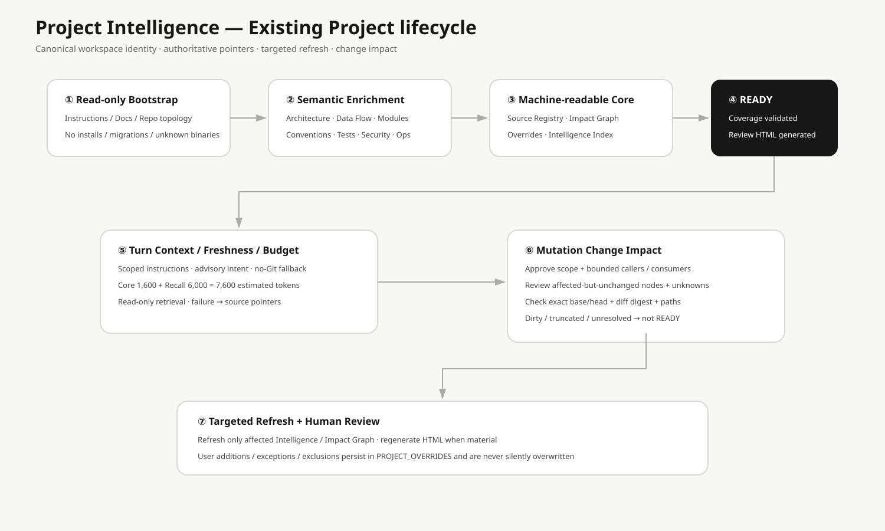

# Project Intelligence 使用指南

Retrieval 保留 `scripts/retrieval_intelligence.py` 作為相容入口；comment/string masking 與 lexical relation row 建構由 `scripts/retrieval_relations.py` 負責。這些可重建關係只提供候選，不是 canonical Impact Graph 或完整語義。

Project Intelligence 是 AIPS 對既有專案建立的可重用理解層。

## 第一次 Existing Project

Read-only Discovery 先建立 PARTIAL，再由 Agent 針對 Architecture、Data Flow、Modules、Contracts、DB/Events、Conventions、Testing、Security、Operations 做 evidence-based semantic enrichment；通過 finalize 才是 READY。

Implementation planning may reuse runtime/framework, project rules, toolchain, architecture and API-contract evidence, testing conventions, generated ownership, and nearby examples. Record each source and scope. One local example does not establish a repository-wide rule, and a directory name alone does not prove DDD or Clean Architecture.

Phase 5 的 Widgets 案例可重用的是 OpenAPI client 生成與驗證流程；多個真實產品各自保存 canonical 契約、Profile、產物 ownership 和整合測試。只有新的技術或架構暴露共通缺口，才擴充 AIPS 範例。

## 不重複正式文件

已有 AGENTS / CLAUDE / GEMINI / ADR / OpenAPI / Architecture Docs / Brand / Visual / Quality Artifact 時，只存 Pointer/Metadata。SOURCE_REGISTRY 同時記錄 Runtime visibility。

Turn Context 依 `--target-path` 與 Runtime 選取適用指示；根目錄工作不會套用子目錄的 Adapter 範本。`--intent read|write` 可在語意不明時提供明確任務方向。非 Git 資料夾及尚無首筆 commit 的專案仍可取得基本 Context，歷史查詢則維持不可用。

## 四份核心 Machine-readable 檔

- `PROJECT_INTELLIGENCE.yaml`：Identity / Branch / Worktree / State / Topic pointers。
- `SOURCE_REGISTRY.yaml`：Authoritative source / Scope / Hash / Runtime visibility。
- `IMPACT_GRAPH.yaml`：API / Module / DB / Event / Consumer graph。
- `PROJECT_OVERRIDES.yaml`：使用者核准、補充、例外、排除、Conflict。

## 三軸狀態

~~~yaml
readiness: READY | PARTIAL | BLOCKED
review: UNREVIEWED | REVIEWED | CHANGES_REQUESTED
freshness: CURRENT | STALE | UNKNOWN
~~~

## Human Review HTML

ATTACHED 位於 `.ai/intelligence/reviews/PROJECT_INTELLIGENCE_REVIEW.html`；EPHEMERAL 位於 AIPS External Cache。HTML self-contained、deterministic，只是 Review View。

## Freshness

`aips intelligence refresh-plan --project <project>` returns affected topics, changed source hashes and manual review steps without writing state. Review sources and update only reviewed registry hashes before finalize. Finalize records computed freshness rather than hiding stale authoritative sources. Repeated bootstrap preserves existing Intelligence and points to refresh-plan; workflow files appear as CI graph seeds with partial semantic coverage.

不是任何 Commit 都全量 STALE。AIPS 比較 relevant Source Hash、watched paths、HEAD diff、dirty paths、Branch/Worktree 與 Schema，只 Targeted Refresh 受影響 Topic。

Git 路徑以 NUL 分隔讀取，完整變更集合用於新鮮度判斷；畫面清單可截斷並標示總數。若 Git 掃描失敗、逾時或超過輸出上限，狀態為 `UNKNOWN`，變更工作須先排除原因，不能當成 `CURRENT`。

`aips intelligence refresh` 只處理 squash／rebase 後的 equivalent-tree revision reconciliation：工作樹必須乾淨，且舊／新 tree object 完全相同。內容不同時回報 `SEMANTIC_REFRESH_REQUIRED`，不覆寫 topics。

任務層 freshness 只有在選取的 topic/component 路徑都能映射，且所有受影響 topic 都已知並與選取範圍不相交時，才可證明不相關。沒有選取 topic、source registry 改變、未知影響或路徑無法映射時，回報 `STALE`／`UNKNOWN`；mutation 仍依全域 freshness 封閉。

Core capsule 目標上限為 1,600 tokens，Recall 為 6,000，組裝總估值為 7,600。組裝前先預留時序資料與 topic 指標所需空間，再把剩餘預算交給本機檢索；時序資料或檢索結果超量時會明確標示截斷。估值採 deterministic 字元估算，並非特定模型 tokenizer。Runtime hook 會再次量測最終文字輸出並裁切可選內容，保留 freshness、retrieval status 和來源摘要。

CLI 預設 YAML 只顯示精簡 Context；`--full` 可查看完整診斷，JSON 格式保留機器可讀的完整結構。`full_manifest_characters` 是完整序列化字元數，不是模型 token 數。

Architecture 摘要、核准覆寫與時序文字在進入 Runtime Context 前共用 Runtime Content Safety Boundary。檢索索引不可用時回報穩定錯誤類別與修復指引，同時保留 canonical source pointers。讀取快取受限時會嘗試經驗證的唯讀快照；索引落後目前 revision 時的自動刷新需要 SQLite 快取目錄可寫（含 sidecar 檔）。若沙盒只允許讀取，應為目前 Runtime 指定可寫的 `XDG_CACHE_HOME` 或在可寫 Runtime 中刷新索引；診斷會明確指出寫入需求，不會將舊索引標示為最新，也不會因一般寫入拒絕就要求強制重建。

## Attach / Detach

Attach 將 External Intelligence validated migrate 到 `.ai/intelligence/`；Detach 先 validated sync 回 External Cache，再封存 `.ai/`。

## Change Impact

The shell CLI impact boundary includes the public `bin/aips` launcher, the resolved-checkout `scripts/aips_cli.sh` facade, its source modules, and direct CLI contract and install/update lifecycle consumers. The shell call graph remains a manually reviewed partial graph.

Temporal query 的實作抽至 `scripts/project_intelligence_temporal.py`；`scripts/project_intelligence.py` 仍保留同一 facade 函式與 CLI 路由，Scenario 204 驗證其 identity 和輸出。

Validation-scope metadata is advisory while every Gate still runs the complete validator set. Impact traversal reports scoped callers and consumers; stale retrieval indexes remain an explicit incomplete-evidence condition.

Repository validation-scope metadata can refine candidate-path planning, but current execution remains full-run shadow and does not alter Project Intelligence consumer closure or impact confidence.

Architecture-impact traversal is kept behind `project_intelligence.py` as a compatible internal module; existing callers keep the same function and evidence shape. Retrieval structural graph construction follows the same facade boundary. These extractions preserve indexed evidence, bounded traversal and explicit unknowns.

OpenAPI generator executable/version, declared tool inputs and generated ownership are project-local implementation evidence. Keep them in the Implementation Profile and Phase 3 provenance records; do not promote one project's generator choice into reusable global Project Intelligence. Scenario 196 defines the local execution and rollback boundary.

Project Intelligence can locate OpenAPI specifications and likely consumers, but presence in the repository does not establish contract authority. Implementation Resolution records whether the source is canonical, descriptive, proposed or unresolved before compatibility evidence is used.

Phase 3 的 Implementation Enforcement 只依選定 Profile 的明確路徑範圍檢查目前候選差異。Project Intelligence 提供候選來源與 consumer 線索，但仍須由 Profile 指定權威契約、輸入、生成輸出與品質命令；未知 ownership 或過期證據會阻擋強制模式，不可由檢索結果推定已驗證。

CI、publication preflight 與 documentation trigger policy 的變更，應一併預覽遞迴文件閉包，並以最終差異重新綁定 Core Change Test Matrix。

Python runtime-floor changes also require manual review of shell interpreter selection, managed install/update repair, doctor, canonical facts, CI workflow consumers, tests and docs when Impact Graph traversal is partial or truncated.

Mutation 前建立 CHANGE_IMPACT，涵蓋 Input / Output / Data / Events / Consumers / Security / Invariants / Compatibility / Tests，完成範圍審查並記錄使用者授權後進入 `IMPLEMENTATION_APPROVED`。`unknowns` 可保留舊字串格式，但舊字串仍視為未解並阻擋核准；新的結構化項目記錄 `id`、描述、`OPEN` / `RESOLVED` / `MITIGATED` / `ACCEPTED_LIMITATION`、處置說明、可驗證證據與 Human review。已處置項目必須提供仍有效且位於 repo 內的檔案 SHA-256 證據或符合相同 scope 的 traversal digest，以及 `reviewer: human`、核准參考與時間。`OPEN`、缺漏、過期、越界或 scope 不吻合時仍 fail closed。Seed-scoped traversal 只支援該範圍的判斷，不能把全域 graph coverage 改成 complete。

這只允許依核准範圍實作。`READY` 僅能在實作後記錄完整 base/head SHA、乾淨工作樹、binary diff SHA-256、精確變更檔案集合與 `target_paths`，並完成 Impact Graph 核對及證據。以 `aips intelligence impact-validate --project <repo> --path <artifact>` 驗證；digest、HEAD、路徑集合不吻合或不可驗證時拒絕 `READY`。未解影響不得標記 READY。

當全 repository 圖譜尚未完整，但某個明確架構邊界已依來源核對，可在 `IMPACT_GRAPH.yaml` 使用 `coverage_scopes` 記錄 seed、各維度覆蓋狀態與證據。它只適用於完全落在該範圍內的 seeds，不能把全域 partial coverage 改成 complete；seed 不相符或證據格式無效時仍維持 unknown。

需要 traversal 時，先以 `aips intelligence impact-traverse --project <repo> --seed <symbol> --seed-path <path> --risk-class <class>` 找候選 callers/consumers。風險政策設定最低深度；node、edge 與 depth 都有上限。結果會區分實際修改與受影響但未修改的節點，後者必須記錄 `reviewed_safe`、`requires_change` 或 `unknown`。依賴注入、反射、動態 dispatch、圖涵蓋不足、索引過期與預算截斷都保留為不確定性；高風險 change 有 unresolved 或 truncated 證據時不得標記 traversal 完整。Lexical 關係是 inferred evidence，需人工核對。

若 `impact-validate` 指出節點缺少 final disposition，依錯誤中的路徑檢視 caller/consumer，再明確選擇允許值並重跑驗證；不會根據沒有程式碼差異就自動標成安全。

## Preserve Valid Native Conventions

Explicit Rule → Formatter/Linter/Contract → Shared Abstraction → Majority Convention → Approved Intelligence → Framework Best Practice → AIPS Default。Unsafe/broken legacy pattern 不盲目複製。

## Sensitive Data

Intelligence / HTML 不保存實際 Password、Token、Private Key、Secret env value、Credential 或不必要的敏感 Payload。

## Monorepo

採 System-level + Target Component + Shared Impact relationships 的 Lazy Load，不因整體理解就載入所有 Component。

## Retrieval Intelligence：即時按需檢索

查詢與索引建置使用不同 SQLite 開啟路徑。唯讀環境無法開啟 WAL shared memory 時，不論失敗發生於建立連線或首次查詢，只要沒有待套用的 WAL 且來源在複製期間維持穩定，AIPS 可使用經完整性檢查的暫時快照；仍無法安全讀取時會回報索引不可用，先檢查 runtime 對快取的讀取權限與 sandbox 限制，再考慮重建，不推測索引已損壞。

Project Intelligence 不再只依賴預先整理好的 Topic。AIPS 保留原本的穩定理解層，同時加入一個可以隨時重建的 Retrieval Intelligence 快取。

~~~text
穩定 Project Intelligence
Architecture / Impact Graph / Source Registry / Overrides
                    +
即時 Retrieval Intelligence
Code / Symbol / Test / Git History
                    ↓
          只挑本次任務需要的內容
~~~

例如修改退款邏輯時，系統可以優先帶入退款實作、相關測試、Impact Graph 關聯與過去相關 commit diff，而不是先把整個 orders 目錄或所有 Architecture Topic 塞進 Context。

目前核心採 Local-first Hybrid Retrieval：

- SQLite FTS lexical search；
- 程式 symbol 定義比對；
- test evidence 加權；
- Impact Graph 關聯加權；
- Git commit / diff history；
- Token Budget 限制。

Semantic/Embedding Provider 是可選擴充，不是必要依賴。沒有設定時會誠實標記 `NOT_CONFIGURED`，仍使用本機 deterministic / structural retrieval，不會假裝已做 embedding semantic search。

實際 index DB 放在 AIPS cache，屬於可刪除、可重建資料；`RETRIEVAL_INDEX.yaml` 只記錄版本、workspace、revision、provider 與 coverage，不會取代 repository code 或 Project Intelligence 成為 Source of Truth。

Temporal Project Intelligence 另外以 `TEMPORAL_ASSERTIONS.yaml` 保存具 provenance、observed metadata 與 supersession 的架構事實。Git revision ancestry 是有效期間的權威時間軸；一般工作仍走 Current Snapshot，只有歷史、backport、release branch 或 evolution 問題才使用 `CURRENT`、`AS_OF`、`BETWEEN`、`WHY` temporal query。未知歷史維持 `UNKNOWN`，不由 migration 猜測。

每個結果會保留 path + line（或 commit）、content hash、Git HEAD / dirty fingerprint，並先排除 credential / secret path、限制最大 Context Token。

## Retrieval Quality Evaluation：先量測，再決定下一項技術

AIPS 不會因為「Vector DB、Embedding、Tree-sitter、LSP 或 Sourcegraph 看起來更進階」就直接導入。下一步先使用 repository-specific benchmark，對照：

~~~text
v0.20-style Static Topic Context
                vs
v0.21 Local Hybrid Retrieval
                ↓
Precision@K / Recall@K / F1@K / MRR
Git History Recall
Irrelevant Context Rate
Token Usage
Observed Latency
~~~

其中 Static Topic baseline 是可重現的「v0.20-style」比較基準，不宣稱能逐字重建所有歷史 v0.20 Agent Turn。Benchmark 評的是「本次工程任務能否取得正確 repository evidence」，不是 Agent 整體任務品質。

Suite 會明確列出每個案例的 expected source paths、可選的 history term、baseline topic files、Top-K、Token Budget 與門檻。Benchmark 控制資料應放在 indexed product source 之外，或 ATTACHED project 的 `.ai/` workspace，避免 expected answer 本身被 FTS 找回而污染評估。

Case 另外分成：

- **required**：核心 regression gate；任何 threshold 失敗都會讓 evaluation / CI FAIL。
- **diagnostic**：刻意挑戰目前能力邊界的 stress case；仍會誠實保留 FAIL 與各 metric，但只記成 diagnostic gap，不會為了它直接阻擋 release，也不能把 FAIL 改寫成 PASS。

Diagnostic case 會標註 dimensions，例如 Go / TypeScript、monorepo/shared module、low lexical overlap、synonymy、cross-file call chain。Report 會彙總 gap IDs、gap dimensions 與 failed checks（例如 recall、history、context purity）；只有當某一類 gap 持續出現，才有足夠 evidence 討論 Tree-sitter/LSP、Embedding 或 Sourcegraph。

系統另外區分：

- **reference recall**：Topic 有提到某個 source path；
- **direct source recall**：實際把該 source evidence 取回 Context。

因此不會把「summary 裡有寫到檔名」誤算成已取得真正程式碼 evidence。

Latency 只記錄 observed value，不作為共享 CI 的 pass/fail 門檻；避免 runner 負載造成假 regression。Result fingerprint 只綁定 suite、repository revision / dirty state、deterministic metrics/checks 與 authority boundary；observed latency、machine-local path、index timestamp 不進 fingerprint，因此相同 evidence 不會因 runner 速度不同而變成另一份證據。

~~~bash
aips intelligence evaluate \
  --project /path/to/project \
  --suite retrieval-evaluation.yaml \
  --output retrieval-report.json
~~~

Benchmark 結果只是 evidence。它不會自動開啟 semantic provider、不會自行改 ranking 權重，也不會替 Human 決定下一步要使用 Tree-sitter/LSP、Embedding 或 Sourcegraph。

## Structural Retrieval：已採用的跨檔關係檢索

Structural Retrieval 已在 controlled Trial 通過 full corpus 並取得 Human Adoption Decision，因此現在成為正常 Retrieval Intelligence 的預設 lane。

~~~text
Exact Query Symbol
   ↓
Lexical Index 找引用它的 Bridge
   ↓
Bridge 內其他 Exact Identifier
   ↓
Indexed Symbol Definition
   ↓
Target Definition / Related Test
~~~

例如查詢只知道 `CheckoutCoordinator` 與「downstream allocation / rollback」，系統可以先找到 wiring file，再沿 wiring 中的 exact identifier 找到 inventory reservation definition，不需要 query 直接寫出 `ReserveStock`。

正式採用仍維持幾個邊界：

- Bridge discovery 使用既有 lexical index，不做無限制全庫掃描；
- target resolution 使用 indexed symbol table；
- bridge / identifier / target / test scan 都有 hard limit；
- retrieval evidence 會顯示 structural telemetry 與是否發生 truncation；
- 不新增 Tree-sitter、gopls/LSP、Sourcegraph 或 remote semantic dependency；
- 這是 exact-identifier relation graph，不宣稱 compiler-grade semantic resolution；
- Turn Context 與一般 `aips intelligence retrieve` 預設啟用；
- debug / regression 可用 `--no-structural` 明確關閉；
- Scenario 130 仍保留 explicit OFF/ON Trial replay；
- Retrieval Quality Evaluation 會量測目前已採用的 default behavior。

## Semantic Alias Expansion Candidate Trial：HOLD

Structural Retrieval 採用後，AIPS 先測了一個不需要 Embedding / Vector DB 的 deterministic alias expansion 候選，希望處理 low lexical overlap / synonymy。

這次完整 9-case corpus 的結論不是 PASS，而是 **FAIL / HOLD**：

- `auth-token-expiry`、Go receipt reconciliation、TypeScript session refresh 三個 required case 出現 regression；
- 原本 registration diagnostic baseline 已經 Recall@K=1.0，但 alias candidate 反而降低 source recall；
- `synonym-access-rotation` 仍沒有 source-recall 改善；
- 真正 semantic provider 全程仍正確顯示 `NOT_CONFIGURED`。

因此這個 alias candidate **不採用、不進 Turn Context default**。Scenario 132 會刻意重播這個失敗結果，要求 Trial 回傳 `HOLD`，避免後續只靠調權重把負向 evidence 洗成 PASS。

如果後續還要處理 semantic gap，下一個候選必須是 materially different 的方案，例如真正的 embedding / semantic provider；但開始之前需要另外做 Human review，明確決定 source-code 是否可送往 provider、使用 local 或 remote embedding、成本/快取/隱私/fallback 邊界。Scenario 132 不會自動啟用任何 provider。

## Remote Embedding Retrieval Trial Readiness（Scenario 133）

AIPS 接著準備真正的 remote embedding Trial，但仍然不改正式 Turn Context。

第一版 Trial 只允許傳送 **synthetic Retrieval Quality fixture**，不允許傳 AIPS repository / product source。Credential 沿用 protected CI secret reference，不寫進 source、log 或 report。

~~~text
Synthetic 9-case corpus
   ↓
正式 Retrieval baseline
   ↓
Remote Embedding candidate
   ↓
In-memory cosine ranking
   ↓
同一套 retrieval metrics
   ↓
PASS / FAIL / TRIAL_PENDING / TRIAL_BLOCKED
~~~

邊界：

- 正常 PR / main CI 不呼叫 remote embedding；
- 只有專用 Trial branch 或手動 workflow dispatch 才會嘗試；
- 沒有 `OPENAI_API_KEY` → `TRIAL_PENDING`；
- provider/network failure → `TRIAL_BLOCKED`；
- request、candidate chunks、remote characters 都有 hard limit；
- 不新增 Vector DB，向量只在 Trial runtime 暫存；
- 正常 Retrieval / Turn Context 仍完全不啟用 embedding lane；
- production source transfer 維持 false；
- 即使 Trial PASS，也只能進 Human Adoption Decision，不能自動採用。

第一個 adapter 使用 OpenAI embeddings endpoint，預設 model 為 `text-embedding-3-small`；model 可以用 repository variable 覆寫，但 provider 不因此成為 AIPS 必要依賴。

### 如何完成真實 Provider Trial

Dedicated workflow 會把 machine report 轉成 GitHub Job Summary，因此 **workflow 顯示 SUCCESS 不代表 Trial 已 PASS**。

操作順序：

1. 在 repository 的 GitHub Actions secrets 配置名稱為 `OPENAI_API_KEY` 的 repository secret；不要把 key 寫入 repository、Issue、PR 或 log。
2. 如需覆寫預設 model，可設定 repository variable `AIPS_RETRIEVAL_EMBEDDING_MODEL`；沒有設定時使用 `text-embedding-3-small`。
3. 重新執行 `retrieval-semantic-trial` workflow。
4. 直接查看 Job Summary：
   - `TRIAL_PENDING`：credential 仍不可用，provider 未執行；
   - `TRIAL_BLOCKED`：provider/network/config 有阻塞，維持 HOLD；
   - `FAIL`：品質不達標，保留負向 evidence，不採用；
   - `PASS`：只代表可以進 Human review，仍不能自動啟用 embedding。
5. 只有 `PASS` 且 Human 明確做出 Adoption Decision 後，才可另開正式 adoption change。

目前 normal Retrieval / Turn Context 與 production source-transfer policy 在上述流程中都不會改變。

## Provider-Neutral Local-First Embedding Trial（Scenario 134）

Scenario 133 的 remote adapter 與安全邊界保留，但不再把 remote credential 當成 semantic research 的預設前置條件。Scenario 134 將 embedding Trial 改成 **local-first / remote-optional**：

~~~text
Synthetic 9-case corpus
   ↓
正式 Retrieval baseline
   ↓
Provider selection
   ├─ local（default）→ pinned BGE model → runner-local inference
   └─ remote（optional）→ OpenAI-compatible embeddings
   ↓
In-memory cosine ranking
   ↓
同一套 retrieval metrics / thresholds
   ↓
PASS / FAIL / TRIAL_PENDING / TRIAL_BLOCKED
   ↓
Human Adoption Decision（PASS 也不自動採用）
~~~

預設 local provider：

- runtime dependency：pinned `sentence-transformers`；
- model：`BAAI/bge-small-en-v1.5`；
- model revision：固定 commit，不追隨 mutable `main`；
- dimensions：384；
- 不需要 `OPENAI_API_KEY`；
- 第一次 Trial 可從 Hugging Face 下載 model artifact，但 query / fixture embedding inference 在 GitHub Actions runner 內完成；
- `HF_HUB_DISABLE_TELEMETRY=1`；
- repository/product source transfer 仍為 false；
- model download/load/inference failure → `TRIAL_BLOCKED / HOLD`。

Remote provider 仍可透過 `AIPS_RETRIEVAL_EMBEDDING_PROVIDER=remote` 顯式選擇。只有這條 optional path 才需要 `OPENAI_API_KEY`；若缺少 credential 仍誠實回 `TRIAL_PENDING`。

正常 PR/main validation 不安裝 semantic Trial dependency、不下載 model、不執行 embedding；dedicated `retrieval-semantic-trial` 才安裝 `requirements-semantic-trial.txt` 並執行真正 embedding benchmark。

Scenario 134 不改 production Retrieval / Turn Context。Local Trial PASS 也只代表 evidence eligible for Human review；production embedding lane、cache、source-transfer policy 與 default enablement 都仍需另外 Human Adoption Decision。

## Debug

一般使用不需執行；排錯可用 `aips intelligence status/render/finalize/impact-init/index/retrieve/evaluate`。

`impact-init` 若遇到既有 change ID 會拒絕覆寫並顯示原紀錄位置與狀態。新的變更請用新 ID；確定要重新建立時才加 `--reset`，原 YAML 會先存成同目錄的時間戳備份，輸出會列出 `backup_path`。

## Identity namespace

Project Intelligence follows `orchestration/PROJECT_IDENTITY.md`. EPHEMERAL storage is workspace-scoped by canonical `workspace_id`; repository-wide writer coordination belongs to the isolation layer and uses `repository_id`.
## Runtime Content Safety Boundary

明確的 `XDG_CACHE_HOME` 會原樣保留。預設快取不可寫時，AIPS 可使用目前使用者擁有、權限為 0700 的可重建暫存快取；symlink 與其他使用者擁有的快取會拒絕。外部 Intelligence metadata 不可寫時，可重建 metadata 保存在快取旁並回報 `CACHE_ONLY`；索引 freshness 仍由實際候選比對，canonical 來源與 graph 不會被替代。資料庫被清理後，保留的 metadata 只回報 `MISSING/ORPHANED`；執行 `aips intelligence index --project <path>` 即可重建，不需 `--force`。

Run Dashboard projections consume only sanitized, allowlisted operational facts; prompts, reasoning, raw output, secrets and raw workspace paths remain excluded.

Project Intelligence outputs are AIPS-owned durable content and must pass the Runtime Content Safety Boundary before persistence. Secret findings remain fingerprint-only and never include the detected value.
