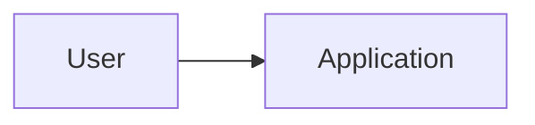

# Technical Architecture

## Context & Constraints

## System Context

## Components / Boundaries

## Architecture Profile

- Style:
- DDD level:
- Dependency rules:

## Data Model

## Integrations

## Security / Trust Boundaries

## Observability

## Performance / Scale Assumptions

## Runtime / Deployment

## Failure / Recovery / Rollback

## Key Architecture Decisions
