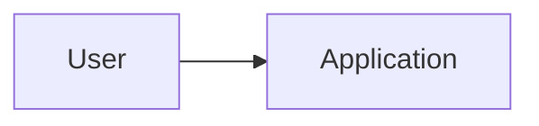

# Technical Architecture

## Context & Constraints

## System Context

## Components / Boundaries

## Architecture Profile

- Style:
- DDD level:
- Dependency rules:

## Data Model

## Integrations

## Security Assurance

- Product Baseline SAL:
- Reliability Impact:
- Critical security floors:
- Protected assets:

## Security / Trust Boundaries

## Observability

## Performance / Scale Assumptions

## Deployment Units

| Unit | Type | Path / Repository | Runtime | Build / Test / Deploy independently? |
|---|---|---|---|---|

## Repository Strategy

- Strategy: monorepo / multi-repo
- Rationale:
- Cross-unit contract strategy:

## Environments

- Local:
- CI:
- Staging:
- Production:

## Runtime / Deployment

## Data Migration

- Required:
- Compatibility:
- Migration order:
- Verification:
- Recovery / rollback:

## Observability

- Health:
- Logs:
- Metrics:
- Alerts:

## Failure / Recovery / Rollback

## Key Architecture Decisions
